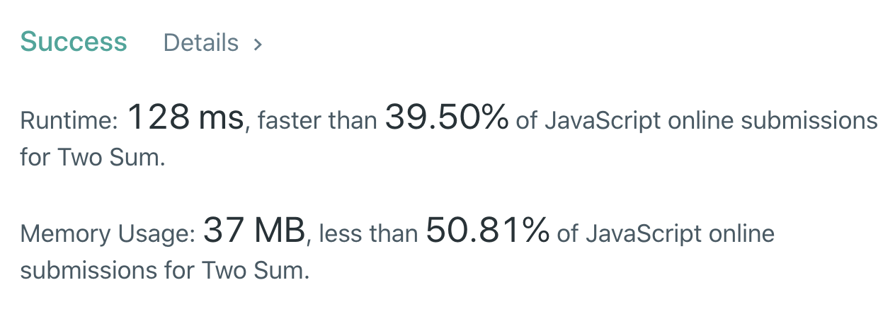
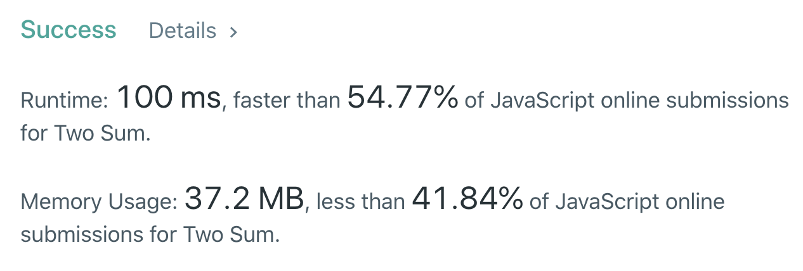
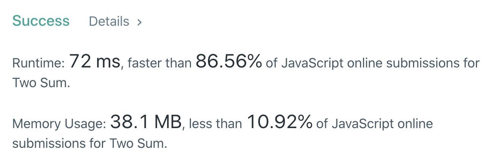

#### <ins class="sub-easy">LEETCODE EASY</ins>


## Problem Statement:

Given an array of integers, return indices of the two numbers such that they add up to a specific <ins class="sub-ins-2">target.</ins>

You may assume that each input would have exactly one solution, and you may not use the same element twice.

**Example:**

```javascript
Input: nums = [2, 7, 11, 15], target = 9,

Output: return [0, 1].
```

`Because nums[0] + nums[1] = 2 + 7 = 9,`

---

## Problem Breakdown:

I believe the problem statement is self explanatory in itself, but if you are amongst the one that still doubt it, let me explain it for you. In layman’s terms, we want to find two elements within the given array that add up to the specific target (which will also be given).

**_<ins class="sub-ins-2">Constraints:</ins>_**

- We cannot re-use the same element twice.(indexes has to be unique).

**_<ins class="sub-ins-2">Clarifications:</ins>_**

- Clarifying if the array is sorted.
- And if a number can repeat twice at different indices in the array.
  - For eg: if the array `[1,1,2,2]` is a valid input.

Here, for this problem we will deal with the array already sorted in non-decreasing order and no two numbers can repeat more than once.

---

## Approach - 1 (Brute Force Approach)

#### <ins class="sub-ins">Time - O(n^2)</ins> | <ins class="sub-ins">Space - O(1)</ins>

The naive approach entails looking at every element in the array, and check if we can find the target.

```javascript
let twoSum = (nums, target) => {
  for (let i = 0; i < nums.length; i++) {
    for (let j = i + 1; j < nums.length; j++) {
      if (nums[i] + nums[j] === target) {
        return [i, j]
      }
    }
  }
}
```



---

## Approach - 2 (Slightly optimised Brute Force)

#### <ins class="sub-ins">Time - O(n^2)</ins> | <ins class="sub-ins">Space - O(1)</ins>

The idea behind this approach is, assume we fix one of the numbers, say 'x', we now have to scan the entire array to find the complement number 'y', which when added to 'x' gives us the target.

```javascript
let twoSum = (nums, target) => {
  for (let i = 0; i < nums.length; i++) {
    let required = target - nums[i]
    for (let j = i + 1; j < nums.length; j++) {
      if (nums[j] === required) {
        return [i, j]
      }
    }
  }
}
```



But can we use some extra space somehow so that the search becomes faster?

---

## Approach - 3 (Optimised Approach)

#### <ins class="sub-ins">Time - O(n)</ins> | <ins class="sub-ins">Space - O(1)</ins>

The idea behind this approach is, to use a hashmap. Using a hashmap improves this solution drastically.

```javascript
let twoSum = (nums, target) => {
  let hashmap = {}

  for (let i in nums) {
    let current = nums[i]
    let difference = target - current
    let required = hashmap[difference]

    if (required != undefined) {
      //required is the index on the hashmap whereas i is the index of the current number or the complement number
      return [required, i]
    }
    // console.log(hashmap)
    hashmap[current] = i
  }
}
```



---

## Conclusion

We now have a fair idea on how to solve any leetcode problem in a few different ways. The key takeaway is, we should always start with the naive/brute force approach and make optimisations until we reach the most efficient soluton.

Happy Coding.
