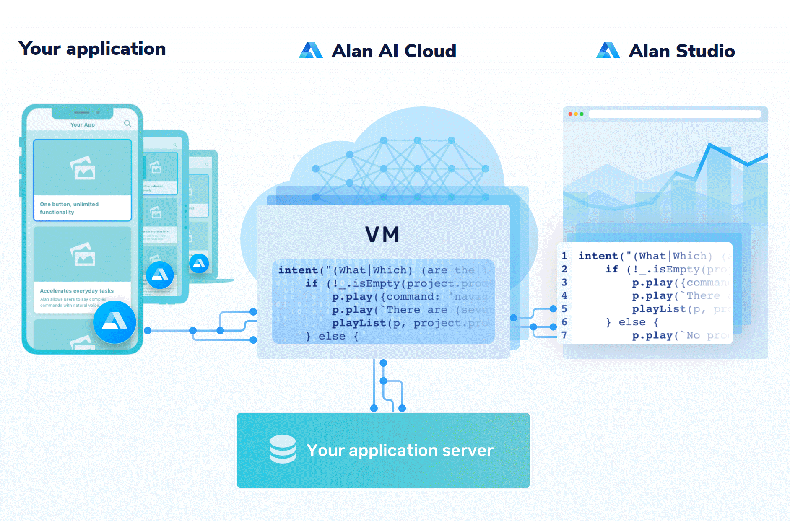

## What is Alan AI?

<ins class="sub-ins-2">Alan</ins>Conversational <ins class="sub-ins-2">Voice</ins> <ins class="sub-ins-2">AI</ins> platform that allows you to create a voice interface for applications and webpages. Alan makes it easy to develop machine learning models, train the speech recognition software and you don't have to bother about hosting your solution at all.

Alan takes care of all voice-related tasks, so you can quickly build a <ins class="sub-ins-2">voice</ins> <ins class="sub-ins-2">assistant</ins> for your application that does all the trick, with minimal changes to the existing UI and workflows.

With Alan, you can create <ins class="sub-ins-2">scripts</ins> (written in JavaScript) to build a voice interface for any kind of application. These scripts has unlimited voice functionality. Alan can also integrate well with iOS, Android and web solutions, as well as <ins class="sub-ins-2">cross-platform</ins> frameworks like Flutter and Ionic.

---

## How can you work with Alan?

The Alan platform offers the following components, as an environment of interaction:

- Alan <ins class="sub-ins-2">Studio</ins>
- Alan <ins class="sub-ins-2">SDKs</ins>
- Alan <ins class="sub-ins-2">Cloud</ins>

### 🤖 <ins class="sub-ins">Alan Studio:</ins>

- The Alan Studio is an environment where developers can write voice <ins class="sub-ins-2">scripts</ins> for their applications.
- The Alan Studio provides number of tools for convenient and easy scripting, <ins class="sub-ins-2">debugging</ins> and <ins class="sub-ins-2">testing</ins> .

### 🤖 <ins class="sub-ins">Alan SDKs:</ins>

- Alan makes it easy for your application to execute <ins class="sub-ins-2">voice</ins> <ins class="sub-ins-2">commands</ins> from scripts. You just need to add the Alan button onto your application using the <ins class="sub-ins-2">Alan SDK.</ins>
- Upon integration, a small button pops up on the application UI. That is the Alan button which activates the voice interface and indicates the processing state.

### 🤖 <ins class="sub-ins">Alan Cloud:</ins>

- With Alan, you do not need to plan for and deploy servers and other IT infrastructure to run voice scripts. The solution architecture is <ins class="sub-ins-2">serverless</ins>: voice scripts are run on virtual machines in the cloud managed for you.
- Alan is highly <ins class="sub-ins-2">scalable</ins>. It can scale up to millions of users as your requirements grow.
- All resources to scale the essential workloads are all automatically provisioned by Alan.

---

To know more about <ins class="sub-ins-2">Alan</ins> visit the links below.

- [Official Documentation.](https://alan.app/docs/usage/getting-started)
- [Official Website](https://alan.app/)
- [Next Gen UX with Voice AI](https://www.youtube.com/channel/UCrsg0b32nL6L2j5jG7uxOuw)
