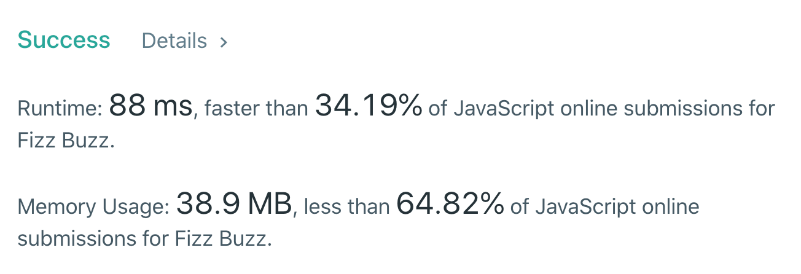
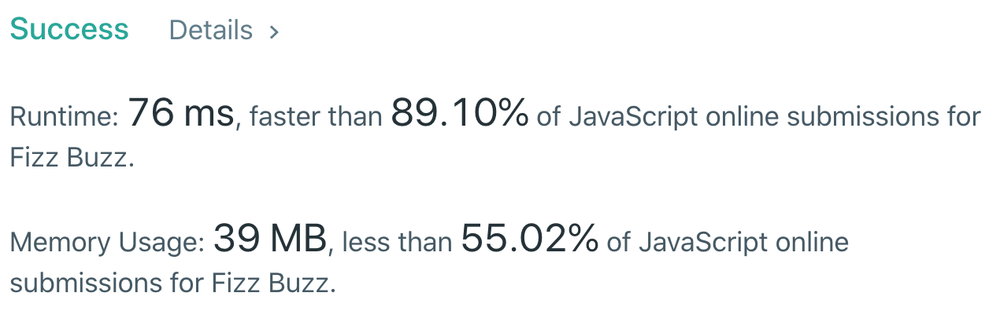
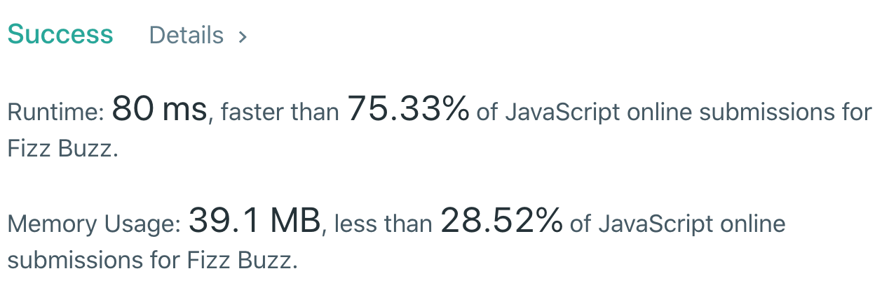

#### <ins class="sub-easy">LEETCODE EASY</ins>


> The "Fizz-Buzz test" is an interview question designed to help filter out the 99.5% of programming job candidates who can't seem to program their way out of a wet paper bag.

#### ⦾ **_Source - [Wiki](https://wiki.c2.com/?FizzBuzzTest)_**

Today we are going to tackle a common interview problem "FizzBuzz", which when solved in the right way can rightly make you a programmer that can write efficient code.

## The problem statement says:

Write a program that outputs the string representation of numbers from 1 to n.

But for multiples of three it should output <ins class="sub-ins-2">“Fizz”</ins> instead of the number and for the multiples of five output <ins class="sub-ins-2">“Buzz”</ins>. For numbers which are multiples of both three and five output <ins class="sub-ins-2">“FizzBuzz”</ins>.

**Example:**

```javascript
n = 15,

Return:
[
    "1",
    "2",
    "Fizz",
    "4",
    "Buzz",
    "Fizz",
    "7",
    "8",
    "Fizz",
    "Buzz",
    "11",
    "Fizz",
    "13",
    "14",
    "FizzBuzz"
]
```

---

## ⦾ Approach - 1 (Basic)

#### <ins class="sub-ins-2">Time - O(n) | Space - O(n)</ins>

For the basic approach we run through 'n' specified (from 1 to n) and find if the numbers are a multiple of 3, 5, or both 3 and 5. For each of these case we output "Fizz", "Buzz" and "FizzBuzz" respectively and if none of the condition holds 'true' return the number itself and push it to the array of results.

```javascript
/**
 * @param {number} n
 * @return {string[]}
 */
var fizzBuzz = function (n) {
  let result = []

  for (let i = 1; i <= n; i++) {
    if (i % 15 === 0) {
      result.push("FizzBuzz")
    } else if (i % 5 === 0) {
      result.push("Buzz")
    } else if (i % 3 === 0) {
      result.push("Fizz")
    } else {
      result.push(i.toString())
    }
  }

  return result
}
```



Not quite fast enough? Let us approach this in a different way.

---

## ⦾ Approach - 2 (Optimized)

#### <ins class="sub-ins-2">Time - O(n) | Space - O(n)</ins>

This approach is quite faster than the previous basic approach as now we don't have to make multiple checks for 3, 5, 3 & 5 together and so on.

Imagine a scenario where we are asked to check for another number '7', and we will have a few different checks for 7 alone with the basic approach, as we might have to check for 7, 3 & 7, 5 & 7, 3 & 5 & 7.

Thats massive 4 checks, and this might get even worse when we have few different checks for few different numbers.

But having 7 checked with the second approach is as easy as writing an 'if' statement to check if the number is completely divisible by 7.

```javascript
/**
 * @param {number} n
 * @return {string[]}
 */
var fizzBuzz = function (n) {
  let result = []

  for (let i = 1; i <= n; i++) {
    let string = ""

    if (i % 3 === 0) {
      string += "Fizz"
    }

    if (i % 5 === 0) {
      string += "Buzz"
    }

    if (string.length === 0) {
      string += i
    }

    result.push(string)
  }

  return result
}
```



Much much faster!

---

## ⦾ Approach - 3 (Optimized w/ Map)

#### <ins class="sub-ins-2">Time - O(m \* n) | Space - O(n)</ins>

Now for the very last scenario, what if instead of adding multiple checks we need to delete them. That would mean, everytime we are asked to delete a check we need to keep modifying our code. Thats not really helpful right?

So what if we create a HashMap that has all the mappings of 'i' to its corresponding word `Map { 3 : 'Fizz'}`.

So now basically even if we have to remove any checks, we can only delete the corresponding key mappings from the HashMap and not mutate the actual code itself.

```javascript
/**
 * @param {number} n
 * @return {string[]}
 */
var fizzBuzz = function (n) {
  let result = []

  let mappings = {
    3: "Fizz",
    5: "Buzz",
  }

  for (let i = 1; i <= n; i++) {
    let string = ""

    for (let key in mappings) {
      if (i % parseInt(key, 10) === 0) {
        string += mappings[key]
      }
    }

    if (string.length === 0) {
      string += i
    }

    result.push(string)
  }

  return result
}
```



Very much optimized!

---

Now that we understand how to approach this problem in few different ways, next time you are asked to code <ins class='sub-ins-2'>FizzBuzz</ins> for your interview, you know how to get it done.

Happy Coding!
