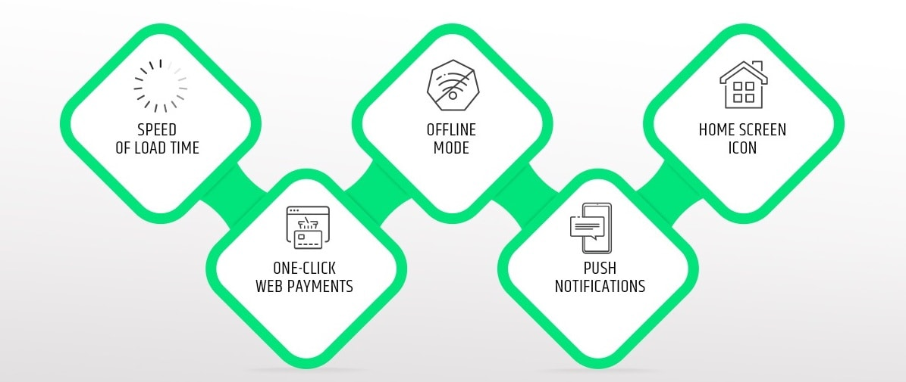

Progressive Web Apps (PWA) are built and enhanced with modern APIs to deliver native-like capabilities, reliability, and installability while reaching anyone, anywhere, on any device with a single codebase.

#### ⦾ **_Source - [Web Dev](https://web.dev/what-are-pwas/)_**

PWA's essentially combines the use of advanced and critical modern technologies, architectural and design concepts, along with Web APIs to provide an app-like experience on the mobile. More importantly, they are device-agnostic, and run inside modern web browsers.

---

## The 3 Pillars of PWA's success

The underlying three major factors that PWA's persist, helps transform normal web applications into a native application like experience that are very capable, reliable and installable.

#### <ins class="sub-ins">Capablility</ins>

The features that was well stacked for native apps has now rightly been expanding to limits we have never imagined. New web API's are now written to control features that deals with file system access, media controls, app badging support.

The modern apps built in compliance to progressive enhancement principles provides a rigour design strategy with the basic functionality and content accessible to everyone regardless of browser compatibilities or connection quality, while delivering sophisticated page versions to users.

Between modern APIs, Web Assembly, and new and upcoming APIs, web applications are more capable than ever, and those capabilities are only growing.

#### <ins class="sub-ins">Reliability</ins>

A Progressive Web App is very reliable knowing it is fast and dependable regardless of the network connection one might be under.

Users desire lightning speed on webpages they visit. Speed is of utmost concern when we think about enhancing user experience. In fact, as page load times increases from 1 second to 10 seconds the probability of a user bouncing increases by 123%.

Performance doesn't stop after the onload event. Users should never be allowed to think twice if their events were registered (for.eg. a button click, or a scroll event), they should never feel disintegrated, switching between pages and everything that the users react with (from scroll to slide to animation) should feel smooth and seamingless.

And with this profound impacts users will surely reckon a PWA to be very reliable.

#### <ins class="sub-ins">Installability</ins>

Progressive Web Apps typically runs in a standalone window instead of a browser tab. They can be launched preety much from anywhere (home screen, docks, taskbar...).

New capabilities open up after a web app is installed. Keyboard shortcuts usually reserved when running in the browser, become available. Progressive Web Apps can register to accept content from other applications, or to be the default application to handle different types of files.

With PWA'S being very installable, users are now exposed to native app like experience and can stay on hold with experiences that were never available before.

---

## Features of Progressive Web Apps

#### Progressive

- Progressive meaning every user, regardless of the browser can now experience the same performance as they are essentially built with progressive improvement principles.

#### Screen Responsive

- PWA's dapt to the various screen sizes: desktop, mobile, tablet.

#### Native-app-like-experience

- PWA's bring in native app like experience to the user, in terms of interaction and navigation.

#### Up-to-date

- Information stays up-to-date. All of this is offered by demon services like service workers.

#### Secure

- Exposed over HTTPS protocol to prevent the connection from displaying information or altering the contents.

#### Searchable

- PWA's are identified as “applications” and are indexed by search engines.

#### Offline Availability

- PWA's will always be available, even if you are offline. Service workers, a built-in mechanism responsible for PWA's progressive features will have already loaded the necessary files, for users to view it offline.

---

## Comparision Chart

Progressive web apps run fast and are very reliable regardless of the user's mobile operating system and device type, providing rich native user like experience.

PWAs can enhance user experience massively. Thanks to easy installation, discoverability, automated updates, and the offline work mode and lot more features PWA has to offer.

#### ⦾ **_Source - [Altexsoft](https://www.altexsoft.com/blog/engineering/progressive-web-apps/)_**

Conversion rate increased mammothly by 70%, 30% increase in speed gain, 88% performance improvement, 5x lower data usage, and 23% increase in the number of searches. These benefits are enjoyed by the big players in the global digital economy, including Twitter, Washington Post, Forbes and Virgin America. And all of them adopted PWAs for their applications.

Progressive Web Apps are constantly gaining traction. Various big tech to mid-sized to startups are amongst the early adopters. PWA's will certainly change the nature of game going forward and has a very promising future ahead of itself.

### References

#### ⦾ [Web.Dev](https://web.dev/what-are-pwas/)

#### ⦾ [Medium](https://medium.com/iquii/progressive-web-app-pwa-what-they-are-pros-and-cons-and-the-main-examples-on-the-market-318f4538c670)

#### ⦾ [Altexsoft](https://www.altexsoft.com/blog/engineering/progressive-web-apps/)
