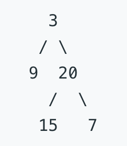
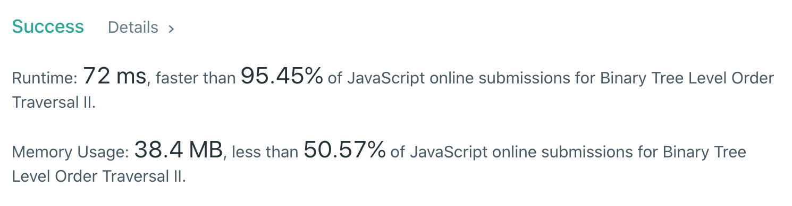

#### <ins class="sub-easy">Leetcode Easy</ins>

## Problem Statement:

**Given a binary tree, return the bottom-up level order traversal of its nodes' values. (ie, from left to right, level by level from leaf to root).**

**_For example:_**

Given binary tree -> [3, 9, 20, null, null, 15, 7],



return its bottom-up level order traversal as:

```bash
[[15, 7], [9, 20], [3]]
```

---

## Algorithm to solve this problem:

- Create an array called `result` that we will return eventually.
- Since we are implementing Breadth First Search (BFS) for bottom-up traversal we will be using queue for this problem.
- Push the very first node, i.e. the root to the queue.
- Iterate while queue is not empty.
  - Make a variable `nodeCount` that keeps track of number of nodes that we need to remove from the queue. That will very much depend on number of nodes in a level.
  - And also a `helperRowArray` that stores all the nodes in a level.
  - Run a while loop till `nodeCount` is zero.
    - Remove the currentNode from the queue.
    - Check if it has a left and right child, if yes, push both of them into the queue.
    - Now we have all our elements in a level stored in the `helperRowArray`.
    - Push that in the front of the resultant `result` array.
    - and decrement the `nodeCount`.
- Finally after traversing all the nodes in the binary tree we have our result stored in `result` array that we can finally return.

---

## Solution (Breadth-First-Search Approach):

#### <ins class="sub-ins-2">Time - O(V+E) | Space - O(E)</ins>

```javascript
//  Definition for a binary tree node.
//      function TreeNode(val, left, right) {
//        this.val = (val===undefined ? 0 : val)
//        this.left = (left===undefined ? null : left)
//        this.right = (right===undefined ? null : right)
//  }

//   @param {TreeNode} root
//   @return {number[][]}

var levelOrderBottom = function (root) {
  // array that stores the final result
  // after bottom-up level order traversal
  let result = []

  if (root === null) return result

  // BFS approach, we use a queue
  // for this approach
  let queue = []
  // push the root node to the queue
  queue.push(root)

  // continue until queue is empty
  while (queue.length != 0) {
    // we take the count of total nodes inside the queue
    // since for the later part we might have left and right
    // child since we need to push all the nodes in a level
    // at a time
    let nodeCount = queue.length
    // helperRowArray helps us with
    // storing nodes in a level
    let helperRowArray = []

    while (nodeCount > 0) {
      // remove elements from the start of the queue
      let currentNode = queue.shift()

      // and check if current node has left and right nodes
      // if yes, push them to the queue
      if (currentNode.left !== null) queue.push(currentNode.left)
      if (currentNode.right !== null) queue.push(currentNode.right)

      // finally push all the nodes in a level
      // to the helperRowArray that later gets pushed
      // to the resultant array
      helperRowArray.push(currentNode.val)
      nodeCount--
    }
    // push items to the start of the queue
    // so they stack up reverserd (bottom-up)
    result.unshift(helperRowArray)
  }
  return result
}
```

### Submission Details:

#### <ins class="sub-ins-2">34/34 test cases passed</ins>


