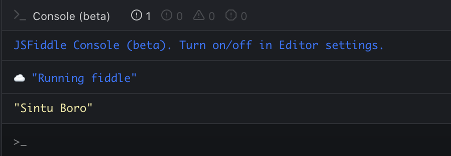

> **_DISCLAIMER_** : This might trip you off. It might get hard to wrap your head around at first, but we are still going to try. Let's do this.


## <ins class="sub-ins-2">The Background:</ins>

I have always spent my time coding in <u>JavaScript</u> and I haven't really found a reason why I shouldn't. I have been involved doing stuff on the web and the most easy step to not feel poignant while doing things on the web is to learn JavaScript.

I have been writing a lot of JS code lately, but but, there comes a point where JavaScript really doesn't make sense and sometimes I feel JavaScript was made to not make a lot of sense.


You now might ponder why I ever felt that, when you think JavaScript is pure power to the web. I completely agree with you but I probably feel you have only started writing JavaScript code and haven't been through the despair yet.

With that in mind let me introduce you to a concept called closure that you felt never existed and tell me after if you still think JavaScript is cool and fun!

**LETS BEGIN!**

In simple words, a closure gives you access to an outer function’s scope from an inner function. In JavaScript, closures are created every time a function is created.

To understand closure, define two functions A and B, where B is the function inside A and return both of them.

You will see the inner function B will have access to the variables in the outer function A's scope, even after the outer function has returned and is done execution.

Let us try that in code:

### <ins class="sub-ins">Lexical Scoping:</ins>

```javascript
function A() {
  var name = "Sintu Boro"
  function B() {
    console.log(name)
  }
  B()
}
A()
```

Here function 'A' has a local variable called name and a function called 'B'.

The function 'B' is an inner function that is defined inside 'A' and is available only within the body of the function 'A' .

Notice the 'B' function has no local variables of its own. However, since inner functions have access to the variables of outer functions, 'B' can access the variable name declared in the parent function, 'A' even if the parent function has returned.



And there you have a _console.log_ on your fiddle.

### <ins class="sub-ins">Closures:</ins>

```javascript
function A() {
  var name = "Sintu Boro"
  function B() {
    console.log(name)
  }
  return B
}

var C = A()
C()
```

Running this code has exactly the same outcome as the previous example above. But what's different and interesting here is that the function B or the inner function has returned from the outer function even before the outer function was executed.

> Once function A finishes executing, you might expect that the name variable would no longer be accessible. However this is not the case in JavaScript.

The reason is that functions in JavaScript form closures. A closure is the combination of a function and the lexical environment within which that function was declared. In this case, function C is a reference to the instance of the function A created when A is run.

The instance of B maintains a reference to its lexical environment, within which the variable name exists. For this reason, when C is invoked, the variable name remains available for use, and "Sintu Boro" is passed to the console for logging.

_**And there you go, you now atleast know the term 'Closure', and the very next time you are asked what Closures really are, you should know it all (or just a bit of it)**_

For more about closures I have attached few links below that will help you cement your knowledge on Closures.

## Links

[Master the JavaScript interview. What is a Closure?](https://medium.com/javascript-scene/master-the-javascript-interview-what-is-a-closure-b2f0d2152b36)

[Closures-JavaScript MDN](https://developer.mozilla.org/en-US/docs/Web/JavaScript/Closures)

[Javascript-Scope-Closures](https://spin.atomicobject.com/2014/10/20/javascript-scope-closures/)
