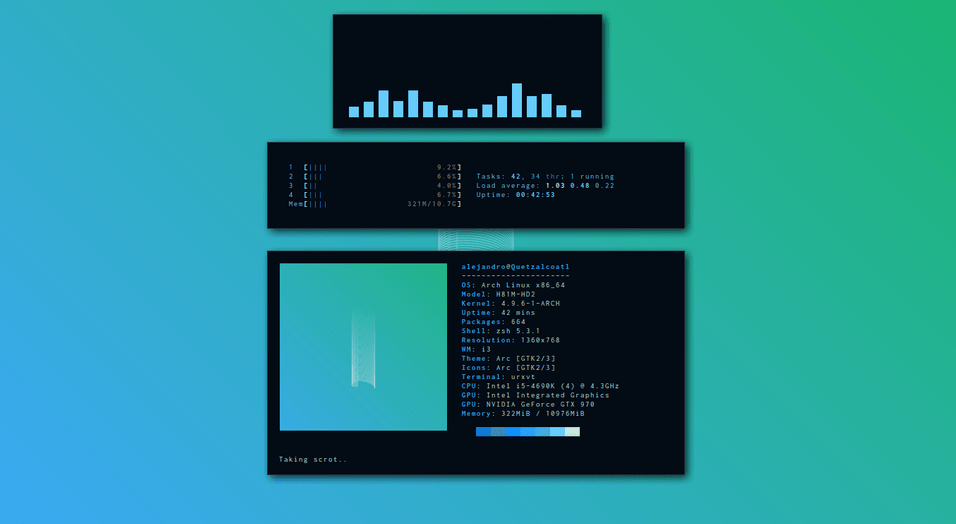
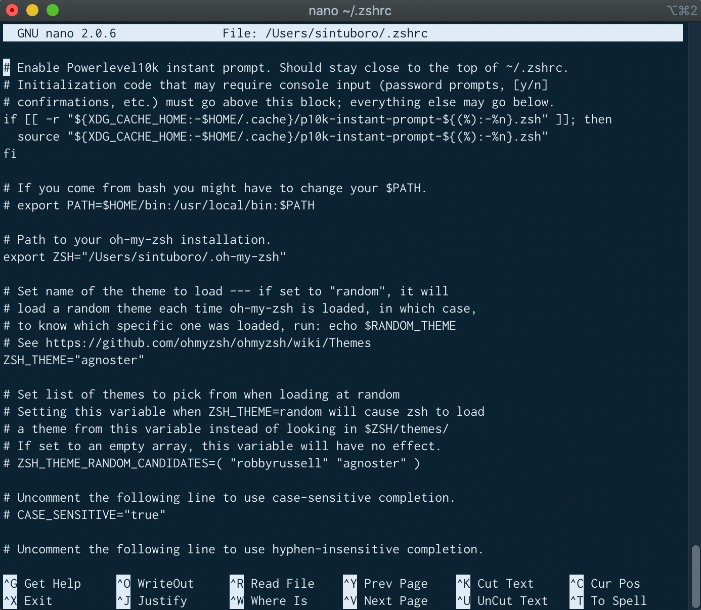
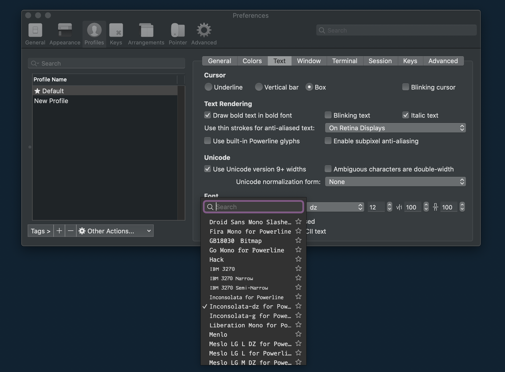
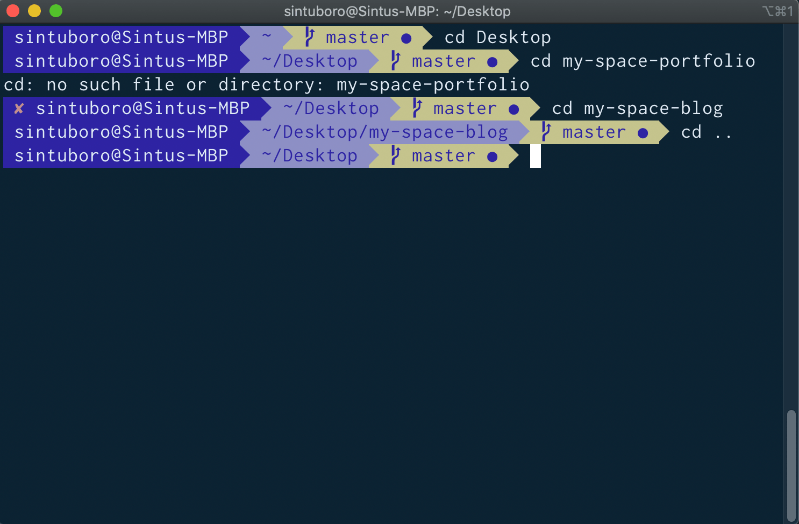

You own a mac and use terminal often for navigating through a directory or copy a file, or perform complex automations and use it for programming? But you don't like the tedious look enough and want to change the look and feel of it? If that is you, you probably have come to the right place.

<ins class="sub-ins-2">Z shell</ins> (Zsh) is a Unix shell that is built on top of bash (the default shell for macOS) with additional features. It's recommended to use zsh over bash . It's also highly recommended to install a framework with zsh as it makes dealing with configuration, plugins and themes a lot nicer.

In this walk-through, we will configure iTerm2 with ZSH and its dependencies.

---

## Topics

- <a href="#homebrew">Installing Homebrew</a>
- <a href="#iterm2">Installing iTerm2 (replacement for MacOS terminal)</a>
- <a href="#zsh">Installing Zsh</a>
- <a href="#oh-my-zsh">Installing Oh-My-Zsh</a>
- <a href="#custom">Setting up dependencies to customize the iTerm terminal</a>

---

## <div id="homebrew">⦿ Installing Homebrew</div>

[Homebrew](https://brew.sh/) is a free and open-source software package management system that simplifies the installation of software on Apple's macOS operating system and Linux.

- Before installing Homebrew, we need to install the CLI tools for Xcode.

Open your terminal and run the command:

```javascript
xcode-select —-install
```

If you encounter any error, run `xcode-select -r` to reset xcode-select.

Then, install <ins class="sub-ins-2">Homebrew</ins> using the following command:

```javascript
/usr/bin/ruby -e "$(curl -fsSL https://raw.githubusercontent.com/Homebrew/install/master/install)"
```

---

## <div id="iterm2">⦿ Installing iTerm2</div>

iTerm2 is a GPL-licensed terminal emulator for macOS. It was derived from and has mostly supplanted the earlier "iTerm" application.

Install <ins class="sub-ins-2">iTerm2</ins> using the following command:

```javascript
brew cask install iterm2
```

---

## <div id="zsh">⦿ Installing Zsh</div>

The <ins class="sub-ins-2">Z shell </ins> (Zsh) is a Unix shell that can be used as an interactive login shell and as a command interpreter for shell scripting.

By default, macOs ships with zsh located `in/bin/zsh`.

Let’s install zsh using <ins class="sub-ins-2">brew</ins> and make iTerm2 use it.

```javascript
brew install zsh
```

---

## <div id="oh-my-zsh">⦿ Install Oh My Zsh</div>

<ins class="sub-ins-2">Oh-My-Zsh</ins> is a delightful, open source, community-driven framework for managing your ZSH configuration.

Install <ins class="sub-ins-2">Oh-My-Zsh</ins> using the following command:

```
sh -c "$(curl -fsSL https://raw.githubusercontent.com/robbyrussell/oh-my-zsh/master/tools/install.sh)"
```

Checking the latest version through the command:

```javascript
zsh --version
```

Upgrade to the latest version if you already have Oh-My-Zsh:

```javascript
upgrade_oh_my_zsh
```

Restart iTerm2 to have a new look of the Zsh.

Now, we will need to install all the dependencies for some more customization.

---

## <div id="custom">⦿ Change the default theme</div>

Oh My Zsh has a default theme that is 'robbyrussell'. Change it to theme of your choice. Let me change it to 'agnoster', because I like agnoster.

You then need to select this theme in your `~/.zshrc`. To open the config file (.zshrc), run the command:

```javascript
nano ~/.zshrc
```

Or you can open any text editor using

```
open ~/.zshrc
```

<br/>



Set your zsh theme and update it.

```javascript
source ~/.zhrc
```

---

## ⦿ Using a custom theme

Clone the repository into `custom/themesdirectory` to install a custom theme. We’ll be using `powerlevel9k`;

Clone the repo using:

```javascript
$ git clone https://github.com/bhilburn/powerlevel9k.git ~/.oh-my-zsh/custom/themes/powerlevel9k
```

Then, select this theme in your ~/.zshrc:

```javascript
ZSH_THEME = "powerlevel9k/powerlevel9k"
```

Update your changes by running the command `source ~/.zshrc`

Navigate to `iTerm2 > Preferences > Profiles > Colors` if you don't like the color of the terminal enough and want to change it.

The theme will require powerline fonts. So, let’s install that.

---

## ⦿ Installing Fonts

You will be using <ins class="sub-ins-2">Inconsolata</ins> for thr fonts.

Run the command below to download fonts:

```javascript
git clone https://github.com/powerline/fonts.git

cd fonts

./install.sh
```

To change fonts, navigate to `iTerm2 > Preferences > Profiles > Text > Change Font`.

<ins class="sub-ins-2">Inconsolata</ins> font will now be appear on the fonts list. Select your preferred font.



## ⦿ Install the Color Scheme

Let’s tweak a few color settings to make our terminal look a little better. Navigate to [iTerm2-Color-Schemes](https://github.com/mbadolato/iTerm2-Color-Schemes) and download the `ZIP`. Extract the downloaded folder.

[iTerm2-Color-Schemes](https://github.com/mbadolato/iTerm2-Color-Schemes) has many exciting themes to choose from, we will chose the theme <ins class="sub-ins-2">Blazer</ins>.


- Navigate to `iTerm2 > Preferences > Profile > Colors > Color Presets > Import`
- Navigate to the schemes folder and select your preferred color schemes to import them.
- Click on a specific color scheme to activate it.



---

Voila! We now have our customized iTerm set up with some good color scheme and this now looks much better, right?

Hope you guys enjoyed this tutorial as much as I did. Feel free to customize the colors as you like and make it look really great. Thanks!
