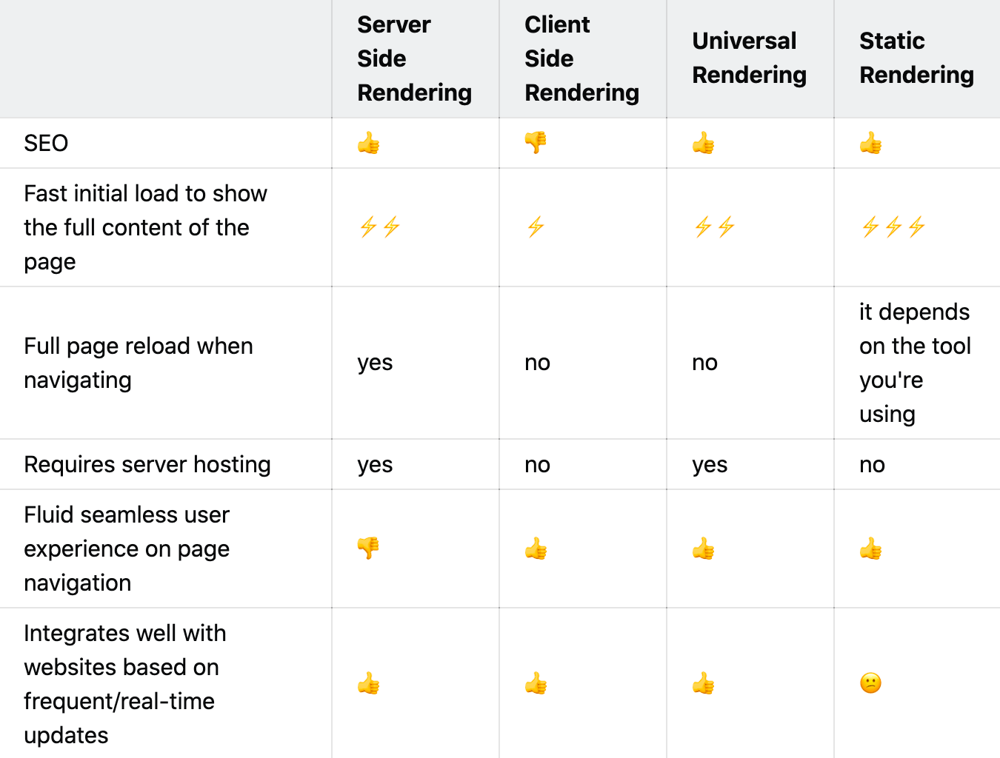

Yet another nightmare developers face when they have to choose between the CSR & SSR. What do they even mean ? What are the performance differences on both of these technologies? Today, we are going to dive a little deeper into the terminologies and will hopefully draw enough points that can help you decide which one should be preferred over another and when.

> For SSR, the server’s response to the browser is the HTML of your page that is ready to be rendered, while for CSR the browser gets a pretty empty document with links to your javascript. That means your browser will start rendering the HTML from your server without having to wait for all the JavaScript to be downloaded and executed. In both cases, React will need to be downloaded and go through the same process of building a virtual dom and attaching events to make the page interactive — but for SSR, the user can start viewing the page while all of that is happening. For the CSR world, you need to wait for all of the above to happen and then have the virtual DOM moved to the browser DOM for the page to be viewable.

-- Walmart Labs — [The Benefits of Server Side Rendering Over Client Side Rendering](https://medium.com/walmartglobaltech/the-benefits-of-server-side-rendering-over-client-side-rendering-5d07ff2cefe8)

---

Let us understand what this terminologies are one by one:

## Server Side Rendering

- The user sends an HTTP request to the website through a browser.
- The server checks the resource, parses the HTML content and makes it ready to be sent over to the browser.
- The HTML now reaches the browser and at the same time ready to be rendered.
- The browser downloads all the HTML and the site is now visible to the user.
- The browser even though has painted an HTML page; the interactivity to the site is still missing.
- The browser downloads all the neccessary JavaScript content and makes the site ready to interact on user events.

Since all of the event starting from getting the dynamic content, parsing it to HTML, and sending responses to the browser is dependent on the server, this process is called server-side rendering (SSR).

---

## Client Side Rendering

- The user sends an HTTP request to the website through a browser.
- Instead of a Server, a CDN (Content Delivery Network) can be used to serve static HTML, CSS and JavaScript files to the user.
- The browser downloads the HTML and JavaScript files all at once while the user sees a loading symbol.
- After the browser fetches the JS, it makes API - requests to fetch any dynamic content and processes it to render the final content.

<!-- > The main difference is that for SSR your server’s response to the browser is the HTML of your page that is ready to be rendered, while for CSR the browser gets a pretty empty document with links to your javascript. That means your browser will start rendering the HTML from your server without having to wait for all the JavaScript to be downloaded and executed. In both cases, React will need to be downloaded and go through the same process of building a virtual dom and attaching events to make the page interactive — but for SSR, the user can start viewing the page while all of that is happening. For the CSR world, you need to wait for all of the above to happen and then have the virtual dom moved to the browser dom for the page to be viewable. -->

---

## SSR Pros over CSR -

- The initial page load is faster.
- The blank page flicker in CSR doesn't usually happen with SSR (although most devs may mask them with loading images).
- Server-side rendering is SEO friendly. Search engines like Google are able to index and crawl webpages efficiently, something that is not very easy in CSR.
- Great performance with static sites and text-based sites as well.

## SSR Cons over CSR -

- Frequent server requests.

  - Possible bottlenecking with sites that are very interactive.
  - Throughput of the server is significantly less than CSR.
  - ReactDOMServer.renderToString() is a synchronous CPU bound call, which holds the event loop, which means the server will not be able to process any other requests till ReactDOMServer.renderToString() completes.

- An overall slow page rendering.
  - While the page is rendered earlier and the users can see the page sooner, they can't really interact with it until react is done executing.

---

## Client-side-rendering :

<iframe width="678" height="381" src="https://www.youtube.com/embed/0bvo6UKkNDA" frameborder="0" allow="accelerometer; autoplay; encrypted-media; gyroscope; picture-in-picture" allowfullscreen></iframe>

## Server-side-rendering :

<iframe width="678" height="381" src="https://www.youtube.com/embed/4-Lel1oaV7M" frameborder="0" allow="accelerometer; autoplay; encrypted-media; gyroscope; picture-in-picture" allowfullscreen></iframe>

## Conclusion :

#### <ins class="sub-ins">Client-side-rendering</ins>

| <ins class="sub-easy">PROS</ins>               | <ins class="sub-hard">CONS</ins>               |
| ---------------------------------------------- | ---------------------------------------------- |
| Rich site interactions.                        | Low SEO if not implemented correctly.          |
| Fast website rendering after the initial load. | Initial load might require more time.          |
| Great for web applications.                    | Requires an external library.                  |
| Robust selection of JavaScript libraries.      | Initial request loads the HTML, CSS and the JS |

 

#### <ins class="sub-ins">Server-side-rendering</ins>

| <ins class="sub-easy">PROS</ins>                            | <ins class="sub-hard">CONS</ins> |
| ----------------------------------------------------------- | -------------------------------- |
| Search engines can index and crawl the site for better SEO. | Frequent server requests.        |
| The initial page load is faster.                            | An overall slow page rendering.  |
| Great for static sites.                                     | Full-page reloads.               |

## Comparision :

## When to use SSR

✅ Use SSR if...

- You need SEO on Yahoo, Bing or Baidu.
- You already have a working React app, and need the best possible performance, and are not willing to pay for the extra servers.

❌ Don't use SSR if...

- SEO on Google is good enough and Google is crawling your content enough.
- Server resources are scarce, perhaps due to a low budget or inability to scale.
