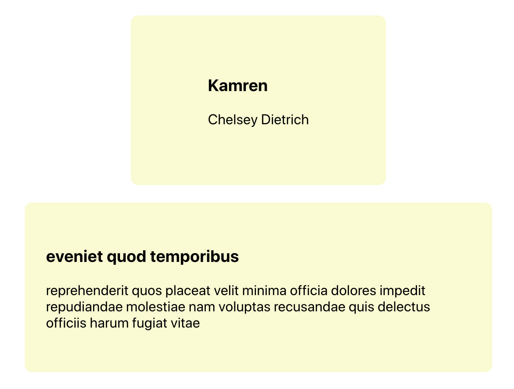

Today we are going to write a reusable custom hook, and build a simple application that uses the custom hook that we will write. what we will have by the end are two components mainly a `User` component and `Post` component.

Each of these components passes an ID using fetch to make a request against the Jason Place holder API. If the user and the post with respective `ID's` exists, the data will be displayed. And, if they don't exist we'll just show the text user not found or post not found.

Now one of the hunches that we will encounter while write the component code is that we'll probably end up writing very similar code. So to avoid any repititive code we write a custom hook component that our user and post component levearages for requesting and retrieving data.

---

## Basic Setup

The only setup you will need for this application is having a react app. Run the following command to get started:

```javascript
npx create-react-app .
```

**_Make sure you have npm version > 5.2, to be able to run npx._**

If not update your npm using:

```javascript
npm install -g npm@latest
```

After you update the npm to the latest stable version, you can now use the npx command to create the react app.

---

## Folder Structure

Everything that we will work on will reside inside the `src` directory, so we don't need to worry about anything else.

The basic folder structure after creating the react app will look something like this:

```javascript
src / App.js
App.css
index.js
index.css
```

You might have files more than this, in case you do, go ahead and delete those files as we will no longer need them for this application.

**_Note: I have only highlighted the src folder since we will only be working inside this directory._**

Now that we have the basic structure ready, we can move ahead.

---

## Creating a components directory

Create a `/components` directory inside of `/src`, that will hold all of our components.

Now inside `/components` directory, go ahead and create three different directories. The first one being `/card` that will be the container that will hold the `user` and `post` data. The second directory will be the `/user` directory that contains our `user` component while the third is the `/post` directory that will contain the `post` component.

Inside `/card`, `/user` and `/post` directories create its files `card.component.jsx`, `user.component.jsx` and `post.component.jsx`.

**_Note_**:

- The `/card` directory will have a `card.css` file for styling the card container.

The folder structure will look something like this after creating all the files:

```bash
- src/
--- components/
----- card/
------- card.component.jsx
------- card.css
----- user/
------- user.component.jsx
----- post/
------- post.component.jsx
```

---

## Card Component

The card component essentially holds the User and the Post data.

`/src/components/card/card.component.jsx`

```javascript
import React from "react"

import "./card.css"

const Card = ({ children }) => <div className="card">{children}</div>

export default Card
```

`/src/components/card/card.css`

```css
.card {
  background-color: lightgoldenrodyellow;
  min-width: 300px;
  max-width: 600px;
  min-height: 180px;
  display: flex;
  justify-content: center;
  align-items: center;
  border-radius: 10px;
  flex-direction: column;
  padding: 30px;
  font-size: 20px;
}

.card > button {
  background-color: white;
  border: 1px solid black;
  cursor: pointer;
  border-radius: 5px;
  min-width: 90px;
  min-height: 30px;
  font-size: 16px;
  margin: 10px 0;
  padding: 10px;
}
```

## User Component

The `User` component essentially displays the user data.

`/src/components/user/user.component.jsx`

```javascript
import React from "react"

import Card from "../card/card.component"

import useFetch from "../../effects/use-fetch.effect"

const User = ({ userId }) => {
  const user = useFetch(
    `https://jsonplaceholder.typicode.com/users?id=${userId}`
  )

  return (
    <Card>
      {user ? (
        <div>
          <h3>{user.username}</h3>
          <p>{user.name}</p>
        </div>
      ) : (
        <p>User not found</p>
      )}
    </Card>
  )
}

export default User
```

We notice there is an import `useFetch` that we haven't written yet. That will be our custom hook that we will be implementing a little later.

---

## Post Component

The `Post` component essentially displays the post data.

`/src/components/post/post.component.jsx`

```javascript
import React from "react"

import Card from "../card/card.component"

import useFetch from "../../effects/use-fetch.effect"

const Post = ({ postId }) => {
  const post = useFetch(
    `https://jsonplaceholder.typicode.com/posts?id=${postId}`
  )

  return (
    <Card>
      {post ? (
        <div>
          <h3> {post.title} </h3>
          <p> {post.body} </p>
        </div>
      ) : (
        <p> No post found </p>
      )}
    </Card>
  )
}

export default Post
```

We import `useFetch` here as well. Let us go ahead and create a seperate component.

---

## useFetch Hook

Inside `/components` create a directory called `/effects` and under `/effects` create a file named `use-fetch.effect.js`, that will hold all the logic of requesting to the API and actually returning the response back to the components.

`/src/components/effects/use-fetch.effect.js`

```javascript
import { useState, useEffect } from "react"

const useFetch = url => {
  const [data, setData] = useState(null)

  useEffect(() => {
    const fetchData = async () => {
      const res = await fetch(url)
      const dataArray = await res.json()
      setData(dataArray[0])
    }

    fetchData()
  }, [url])

  return data
}

export default useFetch
```

The `useFetch` custom hook accepts a 'url', does the fetching and returns the data to the components that requested the data. That is all the `useFetch` custom hook does pretty much. Instead of us fetching data from each of these components we now levearage `useFetch` as a reusable component. And next time we have another few components that requires the same component logic, we already have `useFetch` that can do the trick for us.

---

## App.js

Now for us to display the data on our browser we need to hook our components inside of `App.js` and pass the `id` as props that the components receive.

`/src/App.js`

```javascript
import React from "react"

import User from "./components/user/user.component"
import Post from "./components/post/post.component"

import "./App.css"

const App = props => {
  return (
    <div className="App">
      <User userId={5} />
      <Post postId={15} />
    </div>
  )
}

export default App
```

And after all that is done, we can now see something like this on the screen.



There you go, we have our custom hook up and running. Understandably a custom hook is very much a neccessity when we write components that uses the same component logic. This process bares us from writing any repetitive code and instead write a reusable custom hook component that can be levearaged by various components.

Happy Coding!
