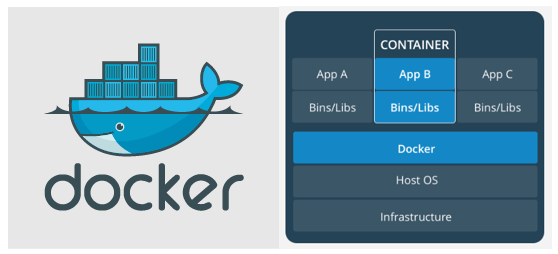

First and foremost you might really wander, what is it? What is a docker anyway? Well if you struggled enough, we gurantee you got an over-simplified answer for that, and you might not really need to refer to anything else ever again.

Before we dive into any crux we would like to take a little note on the things that we are going to cover in this article.

‣ What is a Docker?  
‣ Why do we need them?  
‣ Some Docker terminologies.  
‣ Advantages and Disadvantages of Docker.  

Let's get right into it.

## <ins class="sub-ins">What is a Docker</ins>

> Docker is a tool designed to automate process like creating, deploying, and running applications by using containers. Containers are nothing but a big box that contains all the neccessary amenties (libraries, packages) for the application to run. As simple as that.

You sure do have a question in your mind right now, and it is...

## <ins class="sub-ins-2">Why do we even need them? </ins>

Well imagine you have three different Python applications all running different versions of Python. Now, there's no way you can install all the three different versions on the same system. Hell no! You can't do that.

And if that's the case you can't really deploy all the three different applications on the same system.

Well you probably can, if you are filthy rich and can get yourself three different systems to work with and install one application on each system and your done, you got the way. But NOOO! That doesn't seem just right yet.

<ins class="sub-ins-2">So what's next?</ins>

There's a pretty little trick you might have without having to use docker.

If you have a really really powerful, massive processing power system than you can really go ahead with installing three different VM's that can run three different applications at a time, and there you go, you don't need a docker anymore.

But but but, what if you don't have the priviledge for any of this? Docker is definitely the way around this and let us take a look how. Shall we ?

Now, let’s check out how Docker could be an efficient and cost-effective solution to this problem.

To grab this knowledge, we need to understand how Docker functions under the covers.

Docker is installed and ran on a machine which in simple terms can be called as the Docker Host, just because of hosting the docker.

Everytime you want to deploy or serve an application on the Docker host, it will create a container for you that holds all the neccessary binaries and dependencies for the application to run. Container takes care of holding all the required information.

A Docker Container has no operating system installed on it. But instead it can have access to the virtual copy of the process table, network interface(s), and the file system mount point(s) which are inherited from the operating system of the host.

If you wish to run three different containers on the same host, you can do that without a doubt, and the host OS would be responsible for sharing the underlying resources required for the containers to run.

This entails the concept of isolation boundaries where each container acts as independent entity though they are running on the same host. Matter of fact containers don't care what the underlying OS is.

## Some Docker terminologies:

‣<ins class="sub-ins-2">**Docker Container**</ins>:
A container is a standard unit of software that packages up code and all its dependencies so the application runs quickly and reliably from one computing environment to another. A Docker container image is a lightweight, standalone, executable package of software that includes everything needed to run an application from code, runtime, system tools, system libraries and settings.

‣ <ins class="sub-ins-2">**Docker Images**</ins>:
A Docker image is essentialy a file, comprised of multiple layers, that is used to execute code in a Docker container. An image is built from the instructions for a complete and executable version of an application, which relies on the host OS kernel.

Listed below are the three methods for building or modifying a Docker image:

1. Pull or download from Docker registry.
2. Sweep your Docker image using Docker file and the related directories.
3. Build by committing the modified container.

Below are the few major features of a Docker image:

<ins class="sub-ins-2">_**Portability**_:</ins> The Docker images can easily be pushed or moved into a Docker registry.

<ins class="sub-ins-2">_**Layered nature**_:</ins> Images are added using layers. This enables reusability of images and disk usability is highly reduced as the parent layers are shared.

<ins class="sub-ins-2">_**Static or Compile-time nature**_:</ins> Though you can create a new Docker image, the contents will remain unchanged.

## <ins class="sub-ins">What are Docker Repo, Daemon & Cient? </ins>

‣ <ins class="sub-ins-2">**Docker Repository**</ins>:
A Docker repository is an internet based or network based service which holds Docker images. Docker images can either be pushed or pulled, from or to the Docker repository.

‣ <ins class="sub-ins-2">**Docker Daemon**</ins>:
Docker daemon runs on host system. The users cannot interact directly with Docker daemon but only through Docker clients.

‣ <ins class="sub-ins-2">**Docker Client**</ins>:
Docker Client is the user interface for Docker. Docker daemon will accept the docker commands from users and establishes a connection with Docker daemon.

## Advantages and Disadvantages of Docker

### Advantages of using Docker

_Some of the key benefits of using Docker are listed below:_

‣ Docker can support multiple applications with different application requirements and dependencies, to be hosted on the same machine or host.

‣ Dockers are storage optimized, meaning, a large number of applications can be hosted on the same machine, as containers are usually few megabytes in size.

‣ A container does not have an underlying OS installed on it. Thus, it consumes very little memory in comparison to a virtual machine which generally has an OS running on it.

> _This feature helps reduce bootup time, (we are talking seconds here) compared to VM's which might take couple of minutes._

‣ Another advantage of using docker is security. Since applications running on containers are completely isolated from each other, granting you complete control over traffic flow and management. No Docker container can peek into processes running inside another container.

## Disadvantages of using Docker

Applications having different operating system requirements cannot be hosted together on the same Host machine.

In other words, suppose we have 2 applications, out of which one can only run on a Linux OS and the other application runs on a Windows operating system.

In that case, both the applications cannot be hosted on a single Host machine.

That's all folks, I hope you enjoyed your time reading through the oversimplified Docker terminologies and hope from being an absolute novice you can now explain what a docker is to your friend. Until next time.
