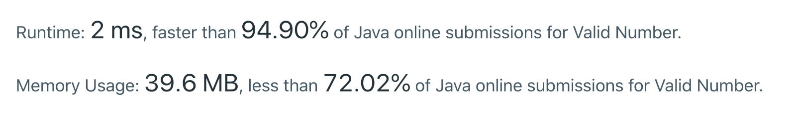

#### <ins class='sub-hard'>LEETCODE HARD</ins> <ins class='sub-ins-2'>👍 763</ins> <ins class='sub-ins-2'>👎 4997</ins>

Bringing to you the one of the most disliked and hardest coding question that Linkedin and Facebook asks while hiring software engineers.
Personally I feel this question doesn't make a lot of sense to me, since it is all about handling the edge cases, and if you miss out on any you might never get it right.

But in case you handle each and every edge case gracefully you are sure to code this in a jiff. Before we actually try and solve this problem we will make sure we list down all the edge cases that we will tackle in order to solve this problem.

Before, let us just look at what the problem statement says:

---

## ⦾ Problem Statement:

Validate if a given string can be interpreted as a decimal number.

Some examples:

```java
"0" => true
" 0.1 " => true
"abc" => false
"1 a" => false
"2e10" => true
" -90e3 " => true
" 1e" => false
"e3" => false
" 6e-1" => true
" 99e2.5 " => false
"53.5e93" => true
" --6 " => false
"-+3" => false
"95a54e53" => false
```

**_Note: It is intended for the problem statement to be ambiguous. You should gather all requirements up front before implementing one. However, here is a list of characters that can be in a valid decimal number:_**

- Numbers -> 0-9
- Exponent -> "e"
- Positive/Negative sign -> "+"/"-"
- Decimal Point -> "."

Of course, the context of these characters also matters in the input.

Doesn't make whole lot of sense right? Let us first jot down the edge cases real quick so we can tackle the problem very easily.

---

## ⦾ Edge Cases:

1. Any other character other than Numbers (0-9), Exponent (e), Positive/Negative Sign (+/-) and Decimal Point (.) will not be consider valid. For example : "1a2".
2. Multiple decimals are not valid. For example: "1.1.2".
3. Decimal after 'e' is not valid. For example: "1e9.2".
4. 'e' at the end is not valid. For example: "12e".
5. Multiple e's are not valid. For example: "12e567e3".
6. No digits before 'e' is also not a valid string. For example: ".e2" or "e78".
7. Sign in between digits is also not valid. For example: "1+9".
8. Sign at the end is also not valid. For example: "222455+".
9. If we don't see any of the digits, it is still not valid.

Now that we have all the edge cases considered, we can now start writing the code.

---

## ⦾ Code Implementation:

Here we also need to consider trimming the string before we actually start iterating over the string, since we are told that string " 0.1 " is valid even though it has whitespaces before '0' and after '1'.

```java
class Solution {
    public boolean isNumber(String s) {

        if (s.length() == null) return false;

        s = s.trim();

        boolean digitSeen = false;
        boolean decimalSeen = false;
        boolean expoSeen = false;

        for (int i = 0; i < s.length(); i++){
            char c = s.charAt(i);
            if (Character.isDigit(c)){
                digitSeen = true;
            } else if (c == '.'){
                if (decimalSeen || expoSeen) return false;
                decimalSeen = true;
            } else if (c == 'e'){
                if (i == s.length() - 1
                || expoSeen
                || !digitSeen)

                return false;

                expoSeen = true;
            } else if (c == '+' || c == '-'){
                if ((i != 0 && s.charAt(i - 1) != 'e')
                || i == s.length() - 1)

                return false;
            } else {
                return false;
            }
        }
        return digitSeen;
    }
}
```

We are returning `digitSeen` and not `decimalSeen` because imagine you have only a (.) and you run through the first else if statement and turn the boolean to 'true'. And then we will return 'true' eventually. But that's not the case, since we have to see atleast a digit, we need to return the `digitSeen` and not `decimalSeen`.



---

Personally, I feel this question doesn't make whole lot of sense, and there's no way you could solve this without knowing all the edge cases already. Yet I chose to put this out of the way and tried to make this problem look oversimplified. That is it for this problem.

Happy Coding.
