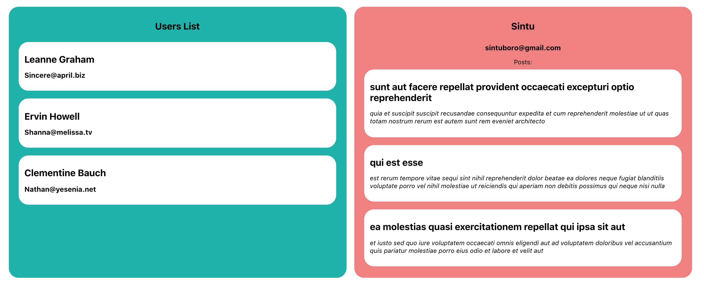

> A higher-order component (HOC) is an advanced technique in React for reusing component logic.

#### ⦾ **_Source - [React Docs](https://reactjs.org/docs/higher-order-components.html)_**

Essentially, a higher-order component is only a function that takes a component and returns a new component. A component transforms props and renders it into the UI, while a higher-order component transforms a component and returns an enhanced and modified component.

If you have ever come through Redux's `connect()`, and react-router-dom's `withRouter()`, you have probably used a higher-order component before.

Today, for the most part we are going to learn about Higher Order Components (HOC) by building a simple one.

## Basic Idea

The very basic idea on the application that we are going to build today is that we are going to hit an endpoint that provides us with `json` data. The endpoint will return us with some kind of user information that we are going to see a little later.

We will have two different components, essentially with the same component logic. Instead of writing the same code for both the components seperately (imagine we have few different components that utilizes the same component logic; no way we want to repeat the same code everytime), we will build a Higher Order Component that would wrap a component that it recieves and returns us an enhanced component back ready to be rendered.

---

## Basic Setup

The only setup you will need for this application is having a react app. Run the following command to get started:

```javascript
npx create-react-app .
```

**_Make sure you have npm version > 5.2, to be able to run npx._**

If not update your npm using:

```javascript
npm install -g npm@latest
```

After you update the npm to the latest stable version, you can now use the npx command to create the react app.

---

## Folder Structure

Everything that we will work on will reside inside the `src` directory, so we don't need to worry about anything else.

The basic folder structure after creating the react app will look something like this:

```javascript
src / App.js
App.css
index.js
index.css
```

You might have files more than this, in case you do, go ahead and delete those files as we will no longer need them for this application.

**_Note: I have only highlighted the src folder since we will only be working inside this directory._**

Now that we have the basic structure ready, we can move ahead.

---

### Creating a components directory

Create a `/components` directory inside of `/src`, that will hold all of our components.

Now inside `/components` directory, go ahead and create two different directories. The first one being `/user-list` that will list all the users we receive from the API and the other one would be `/user-profile`

Inside `/user-list` and `/user-profile` directories create its files `user-list.component.jsx` and `user-profile.component.jsx`.

The folder structure will look something like this after creating all the files:

```bash
- src/
--- components/
----- user-list/
------- user-list.component.jsx
----- user-profile/
------- user-profile.component.jsx
```

---

## User-list component

On the user-list component we will have bunch of users with their name and email. We will receive a whole lot of user data from the API endpoint but we are only going to make use of the name and the email like so.

Inside the user list component, if you don't understand why `withData` is even there, do not worry because that is the Higher Order Component that we will build from scratch on the later part.

<ins class="sub-ins-2">./user-list.component.jsx</ins>

```javascript
import React from "react"

import withData from "../../with-data"

const UserList = ({ data }) => (
  <div className="container user-list">
    <h1> Users List </h1>
    {data.map(user => (
      <div className="post" key={user.id}>
        <h1> {user.name} </h1>
        <h2> {user.email} </h2>
      </div>
    ))}
  </div>
)

export default withData(UserList)
```

## User-profile component

The user-profile component will have data similar to blogposts. It will have the name and email of the user and their blogs listed below.

We can see the `withData` component here as well. That is the whole idea of having an Higher Order Component. We can always reuse them with components having the same component logic.

<ins class="sub-ins-2">./user-profile.component.jsx</ins>

```javascript
import React from "react"

import withData from "../../with-data"

const UserProfile = ({ data, name, email }) => (
  <div className="container">
    <h1>{name}</h1>
    <h2>{email}</h2>
    Posts:
    {data.map(post => (
      <div className="post" key={post.id}>
        <h1>{post.title}</h1>
        <p> {post.body} </p>
      </div>
    ))}
  </div>
)

export default withData(UserProfile)
```

It's time we bring this components inside of the parent component, i.e. `App.js`. Let us do that now!

## App component

We bring in the user-list and user-profile components on our root component. Notice we see a `prop` called `dataSource` on both of our components.

That's essentially because both the components will hit different endpoints for their data, so we can explicitly pass it as a `prop` to the component itself.

Also we pass through `name` and `email` props to the user-profile component to render the name and email on the UI.

<ins class="sub-ins-2">./App.js</ins>

```javascript
import React from "react"

import UserProfile from "./components/user-profile/user-profile.component"
import UserList from "./components/user-list/user-list.component"

import "./App.scss"

function App() {
  return (
    <div className="App">
      <UserList dataSource="https://jsonplaceholder.typicode.com/users" />
      <UserProfile
        name="Sintu"
        email="sintuboro@gmail.com"
        dataSource="https://jsonplaceholder.typicode.com/posts"
      />
    </div>
  )
}

export default App
```

What do we see rendered in the UI? Nothing yet really. It's because we haven't created our Higher Order Component yet. But before that, let us write some `styles` so that the page doesn't look really dull and boring.

<ins class="sub-ins-2">./App.scss</ins>

```scss
.App {
  display: flex;
  justify-content: center;
  padding: 40px;
}

.container {
  width: 45%;
  margin: 0 10px;
  min-height: 200px;
  background-color: lightcoral;
  display: flex;
  flex-direction: column;
  align-items: center;
  border-radius: 25px;
  padding: 20px;

  &.user-list {
    background-color: lightseagreen;
  }

  h1 {
    font-size: 24px;
  }

  h2 {
    font-size: 18px;
  }

  .post {
    background-color: white;
    margin: 10px 0;
    width: 95%;
    padding: 15px;
    border-radius: 25px;

    h3 {
      color: #fcbd77;
    }

    p {
      font-style: italic;
    }
  }
}
```

Now that we have our styles intact, let us build the higher order component, shall we ?

## Building the Higher Order Component

`with-data` component is essentially a function that takes a wrapped component and sends us back an enhanced component.

We have all our state logic inside of the Higher Order Component. It makes a request to the API that we pass through as a `props` to our components, and stores all the required data in the state.

And finally it returns the data in the state to the wrapped component as a `prop`.

<ins class="sub-ins-2">./src/with-data.js</ins>

```javascript
import React from "react"

const withData = WrappedComponent => {
  class WithData extends React.Component {
    constructor(props) {
      super(props)

      this.state = {
        data: [],
      }
    }

    componentDidMount() {
      setTimeout(() => {
        fetch(this.props.dataSource)
          .then(response => response.json())
          // fetching only three recent data
          .then(data => this.setState({ data: data.slice(0, 3) }))
      }, 1500)
    }

    render() {
      const { dataSource, ...otherProps } = this.props

      return this.state.data.length < 1 ? (
        <h1>LOADING...</h1>
      ) : (
        <WrappedComponent data={this.state.data} {...otherProps} />
      )
    }
  }

  return WithData
}

export default withData
```

And after all that is done, we can now see something like this on the screen.



There you go, we have our Higher Order Component running up just like that. Understandably Higher Order Component is very much a neccessity when we write applications that scale. As we know many components might have the same component logic, and instead of writing repetitive code we can instead write an HOC that effectively wraps a component and give us back a component with superpowers.

Thank you for sticking till the end. Happy Coding!
