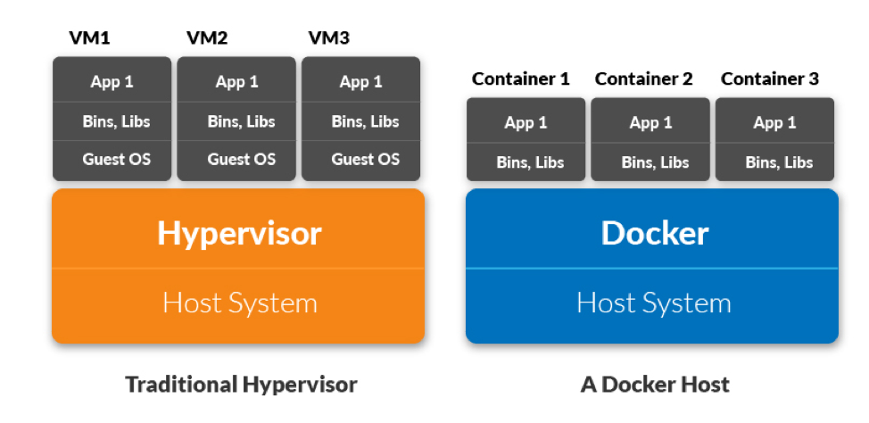

Just a few days before, I tried to oversimplify the concept of **_Docker_** and attempted to make it as beginner friendly as possible. But today, I thought I would take this a moment ahead and explain the difference between docker containers and virtualized machines and where they differ.

Let's just start yet again by defining what <ins class="sub-ins-2">Containers</ins> and <ins class="sub-ins-2">VMs</ins> really are.

Containers and VMs are essentially very similar on how they solve a problem, they both isolates an application and its dependencies in a self enclosing unit, so they can run absolutely anywhere.

But everything that does the same thing doesn't have to be same. The main and the most crucial difference between containers and VMs lies in their architectural approach.

Let's just dive into the sea of wisdom from here. And hope you grab some fish of thoughts with you.

## <ins class="sub-ins">What are Dockers?</ins>

<ins class="sub-ins-2">Docker is a software tool</ins> designed to automate <ins class="sub-ins-2">creation</ins>, <ins class="sub-ins-2">deployment</ins>, and run applications using containers. Containers allow to bundle up an application with all of its dependencies and library it needs, and deploy it as one package.

A forethought, what if we have a few different containers together and they are all running on the same machine. Do we see a causal effect there?

Uhm! Not really. The simple answer is NOO! Containers are self-isolated units, which means no two containers can vibe together. And that's the sole reason containers are secure and multiple containers can run on the same host simultaneously.

Also, containers are very lightweight because they do not require an extra load of hypervisors instead they run directly within the host’s machine kernel.

We will get into the architectural know how in a sometime. You might just want to hold on for now. Let us just understand real quick what VMs are.

## <ins class="sub-ins">What are VM's?</ins>

A VM is essentially an <ins class="sub-ins-2">emulation of a real computer</ins> that executes programs like a real computer. VMs run on top of a physical machine using a <ins class="sub-ins-2">“hypervisor”</ins>. A hypervisor, in turn, runs on either a host machine or on “bare-metal”. You don't really need to worry about hypervisor and its types. You can imagine they all mean the same thing here.

But wait! I don't even know what hypervisors mean. Well well well, I have got you covered. I knew you would have a problem here. Let me explain.

A <ins class="sub-ins-2">hypervisor</ins> is essentially a computer software, firmware or hardware that creates and runs virtual machines. A computer on which a hypervisor runs is called a host machine, and in turn we can run multiple virtual machines on top of hypervisor and each of these machines are called guest machiners.

> In simple words, a hypervisor allows a host computer to support multiple guest VMs by virtually sharing its resources, such as memory and processing.

These resources can be segregated and distributed for different VM's residing on the host machine. So if one VM is running a more resource intensive processes, you might want to allocate more resources to that VM than the one that can run with scanty resources on the same host machine.

Although VM's are really powerful and has a fancy name, in terms of performance it is a bit bleaker. It might have a longer booting time, may consume unneccessary resources and a whole lot. This is where containerization bumps in and you wouldn't regret learning them at all.

## <ins class="sub-ins">Comparing containers and VM's</ins>

‣ <ins class="sub-ins-2">Architectural approach:</ins>

### Docker vs. Virtual Machines

Virtual machines have host OS and the guest OS inside each VM. Guest OS can be anything from Windows, Linux, irrespective of host OS. In contrary, Docker containers shares the host OS among them. Sharing the host OS between containers makes them lightweight and reduces boot time.

> Fun Fact: Containers are not neccessarily always faster than VMs.

Docker containers are handy when they need to run multiple applications over a single OS kernel; whereas, virtual machines are handy when multiple application requires multiple OS to run.

‣ <ins class="sub-ins-2">Security:</ins>

Virtual machines are stand-alone with their kernel and security features. Therefore, applications needing additional administration privileges and security run on virtual machines.

On the contrary, root access and providing administrative access to applications inside a container is not recommended because containers share the same host kernel. As a result, a single infected container can bring down the entire system.

‣ <ins class="sub-ins-2">Performance:</ins>

Virtual machines are resource-intensive than Docker containers since they run on a seperate OS than the host OS.

Scaling up resources in a docker container is relatively simpler and an easy step as compared to scaling up on virtual machines or VMs.

## <ins class="sub-ins-2">The Future of Docker</ins>

Docker is undoubtedly gaining a lot of momentum lately, but in no way it will cause a threat to the VM species anytime soon.

They both have undeniable use cases that can never be fulfilled by any one of them.

For instance, if you need to run multiple applications on multiple VM's,you would probably use VMs for better results. On the other hand, if you need to run many copies of a single instance or an application, Docker is definitely the goto here.

Moreover, while containers allow you to segregate applications into more functional and logical units, to create separation of concerns, it also means trying to manage each of these independent parts now requires an extra effort.

Security has been a major concern with Docker containers since containers share the same kernel. While a VM can only issue hypercalls to the host hypervisor, a Docker container can make syscalls to the host kernel, which creates a huge surface area for attack.

When security is particularly important, developers are likely to pick VMs anyday.

## <ins class="sub-ins-2">Conclusion</ins>

It all boils down to what you want to use it for? Are you running instances of an application or trying to run multiple applications on multiple VMs. Once you have an answer to this problem you would have your bigger problem resolved in no time.

That was it folks! That was all about Docker containers and VMs. Hope you enjoyed it!
