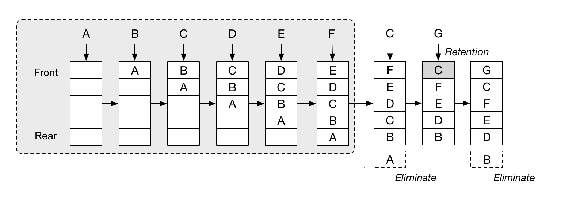

As promised, we are back with the <ins class="sub-ins-2">implementation</ins> of the LRU cache that we discussed about in our last blog. We talked through what a cache is, why we might need them, their performance with respect to time and space complexities and how the LRU <ins class="sub-ins-2">eviction</ins> policy in caches work.

Today we are going to implement the LRU eviction scheme through code.

> An LRU cache is typically implemented using a HashMap and a Doubly Linked List.

### <ins class="sub-ins">Requirements:</ins>

1. **<ins class="sub-ins-2">Fixed Size:</ins>** A cache has a limit and cannot hold infinite amount of information at a time.
2. **<ins class="sub-ins-2">Fast Access:</ins>** Insertion and lookup operations in cache has to be extremely fast (O(1)).
3. **<ins class="sub-ins-2">Eviction Scheme:</ins>** When the cache memory limit exceeds, it has to perform an algorithm that evicts an entry to accept upcoming entries.

---

The LRU cache performs the following steps:

1. Checks if the cache has enough <ins class="sub-ins-2">memory</ins> to store incoming <ins class="sub-ins-2">requests</ins>, if yes, the information is stored.
2. If not enough memory, the least recently used information is removed from the <ins class="sub-ins-2">tail</ins> of the linked list and the new entry is added to the <ins class="sub-ins-2">head</ins> of the linked list.
3. If an already present entry is retrieved from the cache, the entry is moved to head of the list since it has been most recently used.

Our implementation of LRU Cache will make use of <ins class="sub-ins-2">HashMap</ins> (as HashMaps provide O(1) insertion and lookup time) and <ins class="sub-ins-2">Doubly</ins> <ins class="sub-ins-2">Linked</ins> <ins class="sub-ins-2">List</ins> (Doubly Linked List also has faster insertion, updation and deletion rates).

---



### CODE:

> Note: Heavy comment upcoming for you to understand what goes through each step.

#### <ins class="sub-ins">Time - O(1)</ins> | <ins class="sub-ins">Space - O(n)</ins>

```javascript
class NodeLL {
  //initializing constructor with key, value, pointer to the next node, and pointer to the previous node
  constructor(key, value, next = null, prev = null) {
    this.key = key
    this.value = value
    this.next = next
    this.prev = prev
  }
}

//initializing the LRU constructor with its parameters
class LRUCache {
  constructor(limit) {
    this.head = null
    this.tail = null
    this.limit = limit
    this.cache = {}
    this.size = 0
  }

  //adding to the cache
  put(key, value) {
    //check if the cache has hit the limit or if the value already exists in the cache
    this.checkSize(key)

    // if the vaue don't already exist in the cache
    if (!this.cache[key]) {
      //if there is no head
      //if this is the first item in the cache
      if (!this.head) {
        //head and tail will be the same node
        //creating an instance of the class node
        //and assigning the values passed in the parameters
        this.head = this.tail = new NodeLL(key, value)
      } else {
        //if there is already an item in the array
        //make the inserted value as the head
        const node = new NodeLL(key, value, this.head)
        this.head.prev = node
        this.head = node
      }

      this.cache[key] = this.head
      //increment the size since we now have an item in the cache
      this.size++
    } else {
      //check if the key already exists in the cache
      //if it already exists delete the current key
      //and set the same key to the new value
      const node = new NodeLL(key, value, this.head)
      this.head.prev = node
      this.head = node
      this.remove(key)
      this.cache[key] = node
      this.size++
    }
  }

  // Read the cache element
  get(key) {
    if (this.cache[key]) {
      const value = this.cache[key].value
      //the key is removed so that every read item should
      //now appear as the head of the list
      this.remove(key)
      this.put(key, value)

      return value
    }

    console.log(`Item not available in the cache for key ${key}!`)
  }

  // Remove the cache element
  remove(key) {
    const node = this.cache[key]
    //check if the current node to be deleted has a previous node
    if (node.prev !== null) {
      node.prev.next = node.next
    } else {
      this.head = node.next
    }
    //check if the current node to be deleted has a next node
    if (node.next !== null) {
      node.next.prev = node.prev
    } else {
      this.tail = node.prev
    }

    delete this.cache[key]
    this.size--
  }

  // Clear all elements
  clear() {
    this.head = null
    this.tail = null
    this.size = 0
    this.cache = {}
  }

  //perform checks for if the cache is full and if the key is already in the cache
  checkSize(key) {
    if (this.size + 1 > this.limit && !this.cache[key]) {
      this.remove(this.tail.key)
    }
  }
}
```

---

And that is it for the implementation of LRU cache in JavaScript. Happy Coding.
