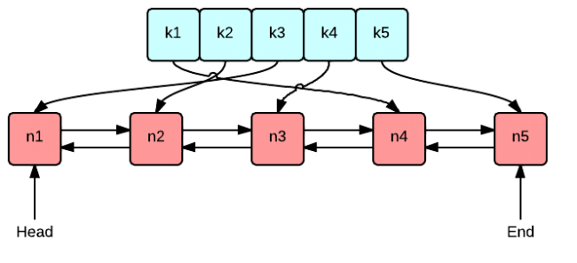

If you are a Computer Science or an IT student you are very likely familiar with the word <ins class="sub-ins-2">'cache'</ins>, or if your not one, you may have still heard of the word. Well the other day, I was on a problem that had me implement an <ins class="sub-ins-2">LRU Cache essentially</ins>. LRU stands for Least Recently Used, and that is one of the many <ins class="sub-ins-2">eviction</ins> policies a cache depends on.

Now you might ask what are these _Eviction Policies_ that we are talking about ?

As we all know everything has a limit, and the same way caches have <ins class="sub-ins-2">bounds</ins> too. That essentially means we can't store <ins class="sub-ins-2">infinite</ins> amount of information on a cache at a time.

If the cache hits its bound (doesn't have empty space), we are supposed to pursue any of the <ins class="sub-ins-2">eviction</ins> policies, so they can accept more items and the items that are not frequently used are <ins class="sub-ins-2">laid off</ins> from the cache in order to free some room.

So a great way to understand a cache is to know how it works and what eviction policies it follows. So today, we have for you the "Least Recently Used Eviction Policy", that we are going to discuss and probably implement as well on another blog that will be a follow-up after this blog.

---

## <ins class="sub-ins">Overview:</ins>

A Least Recently Used <ins class="sub-ins-2">(LRU)</ins> Cache organizes items in order of use, the most <ins class="sub-ins-2">recently</ins> used item will always appear towards the <ins class="sub-ins-2">head</ins> of the cache and the <ins class="sub-ins-2">least</ins> recently used item will appear towards the <ins class="sub-ins-2">tail</ins> end (if you can imagine a cache as an array of blocks)

### Advantages:

- <ins class="sub-ins-2">Fast access</ins>.
- Since LRU cache organizes items in order (most-recently used to least-recently used), accessing items in a cache takes <ins class="sub-ins-2">O(1)</ins> time.
- Super <ins class="sub-ins-2">fast updates</ins>. Each time an item is accessed, updating the cache takes O(1) time again.

### Disadvantages

- Space <ins class="sub-ins-2">heavy</ins>.
- An LRU cache tracking (n) items requires a doubly linked list of length (n), and a hash map holding (n) items.
- That's <ins class="sub-ins-2">O(n)</ins> space.

### Why do we need cache?

Cache is important because it improves the speed of <ins class="sub-ins-2">data retrieval</ins>. It stores program instructions and data that are used repeatedly in the operation of programs that the CPU is likely to need next.

And also reading data from a cache takes less time than reading it from a hard disk.

---

## LRU Eviction Policy:

> Note : An LRU cache is implemented using a HashMap and Doubly Linked List under the hood.

Let us cement the knowledge of LRU Cache using the following example.

> Let us assume 'n' = 3, where ('n' --> cache size/limit).

The LRU Eviction Policy follows the steps below:

- Since, at first we don't have items in the cache, it is repesented in the figure as <ins class="sub-ins-2">Head</ins> and <ins class="sub-ins-2">Tail</ins> nodes pointing to each other.

- Now, we are adding '1', and since '1' is the very <ins class="sub-ins-2">first</ins> item in the cache and will be the head of the linked list.
- Again, we add '2' to the cache, now since '2' has been accessed very <ins class="sub-ins-2">recently</ins>, 2 now becomes the <ins class="sub-ins-2">head</ins> of the linked list. At the same time, 1 is moved further right towards the <ins class="sub-ins-2">tail</ins> of the linked list.
- Now we <ins class="sub-ins-2">retrieve</ins> '1' again. Since, we have accessed '1', '1' moves towards the <ins class="sub-ins-2">head</ins> on the third iteration and '2' moves further towards the <ins class="sub-ins-2">right</ins> (tail end).
- We add '3' again and this time, '1' and '2' moves further towards the right to make space for '3' in the head.
- Now, we try to add another item '4' yet again. But this time if you notice the cache has a limit of '3' and since the cache already has '3' items in it, it has to remove one in order to make space for another.
- In this case the last item '2' will be evicted or thrown out since it appears to be least recently used amongst the three.

- Now, '4' occupies the head of the linked list.

---

And that is all regarding the LRU eviction policy. LRU cache basically removes items that are not recently used to make room for items that is or will be frequently used.

An LRU cache is an efficient cache data structure that can be used to figure out what we should evict when the cache is full. The goal is to always have the least-recently used item accessible in **O(1)** time.

> There are certainly a lot more eviction policies defined for caches, but we sticked with LRU since it's a very common technique that comes up in coding interviews often.
