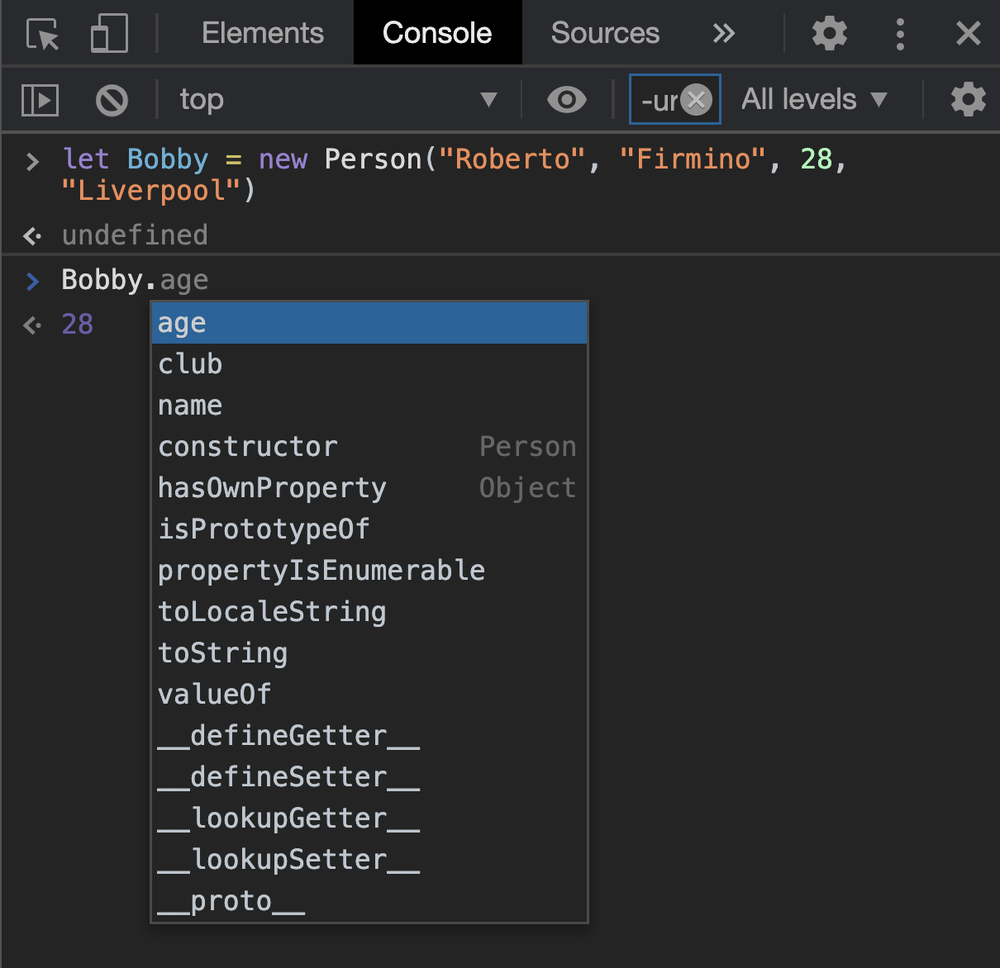
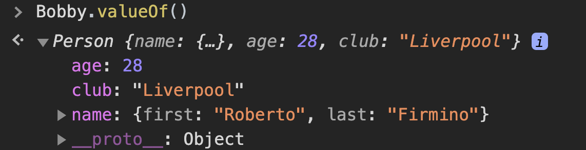

## What are Prototypes?

<ins class="sub-ins-2">Prototypes</ins> can be referred as a mechanism that allows JavaScript objects to inherit features from one another. Inheritance is when an object tries to access a method from another object to implement as their own.

> A son inheriting characteristics from his father is a classic example of inheritance.

Well this is a real complex (not really) situation to wrap your head around at first, if you are fairly new to the JavaScript world but, we will try to explain how <ins class="sub-ins-2">prototype chains</ins> work and display how the prototype property can be used to add methods to existing <ins class="sub-ins-2">constructors</ins>.

## A prototype-based language?

JavaScript is often described as a prototype-based language — to provide inheritance. Objects can have a prototype object, which enables the object to inherit props and methods from the prototype object.

A prototype of an object may also have another prototype object, which it inherits methods and properties from, and so on. This is referred to as a <ins class="sub-ins-2">prototype chain</ins>.

> The properties and methods are defined on the prototype property on the Objects' constructor functions, not the object instances themselves.

## Examples:

Here in the example, we have a **_Person()_** constructor defined as:

```javascript
function Person(first, last, age, club) {
  this.name = {
    first,
    last,
  }
  this.age = age
  this.club = club
}
```

_We can now create an instance of the Person() as:_

```javascript
let Bobby = new Person("Roberto", "Firmino", 28, "Liverpool")
```

Now try typing "Bobby." on your JavaScript console, what do you see? You should probably see the list of all the method names available on this object. See the picture to get an idea what that might look like:



In the list above, you will see the methods defined on Bobby's constructor — Person() — name, age, gender and club. You will however also see some other methods — toString, valueOf, hasOwnProperty and so on. These methods are not defined by you — these are basically defined on Person()'s constructor's prototype object.

Now what do you think happens if you call a method on the instance Bobby?

**_Example:_**

```javascript
Bobby.valueOf()
```

The method — Object.valueOf() is inherited by Bobby because its constructor is Person(), and Person()'s prototype is Object(). valueOf() returns the value of the object it is called on.

_The browser initially checks to see if the Bobby object has a <ins class="sub-ins-2"> valueOf()</ins> method available on it._ It sees that there is no <ins class="sub-ins-2">valueOf()</ins> method, so the browser now checks to see if the <ins class="sub-ins-2"> Person()</ins> constructor's prototype object has a <ins class="sub-ins-2">valueOf()</ins> method available on it. It does, and so it is called, and we recieve the following output in the console.



---

This is it for the prototype in JavaScript. I wanted to keep it short and simple and only give you out with the basic information on prototypes. Well, if you are onto a really detailed explanation of prototypes in JavaScript you can visit the link below.

For more details please visit the [Mozilla CDN](https://developer.mozilla.org/en-US/docs/Learn/JavaScript/Objects/Object_prototypes).

Cheers!
