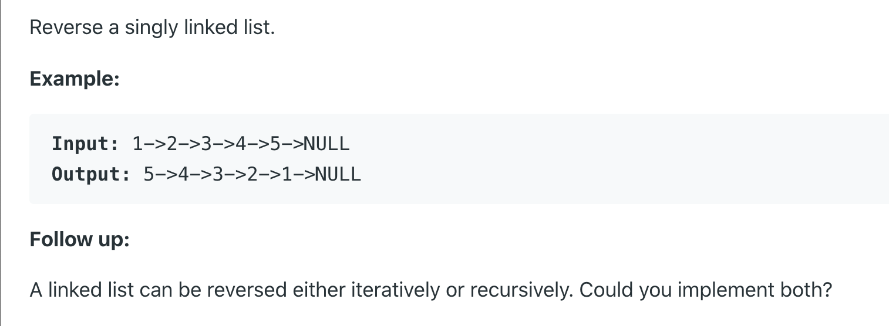
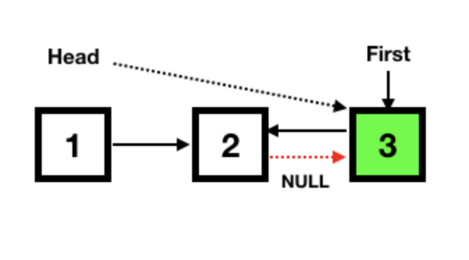

#### <ins class="sub-easy">LEETCODE EASY</ins>

Today we are going to tackle a very classic Link List interview problem. Once, a techlead said knowing how to reverse a linked list can make you omnipotent. Let us try being one today and put it straight in the back pocket, so next time someone asks you if you know how to do it, you already got it.

So, personally I feel this is a really good problem to start with before we can get into any of the complex linked list problems. The problem heavily focuses on manipulating the linked list with pointers. Let us know how.

<ins class="sub-ins-2">The problem statement says:</ins>



## <ins class="sub-ins">Iterative Approach</ins>

To <ins class="sub-ins-2">reverse a LinkedList</ins> iteratively, we need to store the references of the next and previous elements, so that they don’t get lost when we swap the memory address pointers to the next element in the LinkedList.

The following illustration demonstrates how reversing a LinkedList is implemented by changing references.


### Steps to reverse a linked list:

- Check for edge cases (one node or no node).<br>
- Continue till we have a head (an element to reverse).<br>
- Assign two pointers 'prev' and 'next' as **_null_**.<br>
- Save the next node of the current/head element in the next pointer.<br>
- Set the next of the current Node to the previous Node.<br>
- Shift prev to current/head.<br>
- Shift the current/head element to next.<br>

### Implementation of Iterative Approach:

We iterate through the list once, changing the <ins class="sub-ins-2">next</ins> pointer of each node to the previous node. The order of operations is important: we copy <ins class="sub-ins-2">head.next</ins> into <ins class="sub-ins-2">temp</ins> before setting <ins class="sub-ins-2">head.next</ins> to <ins class="sub-ins-2">previous</ins>. Because we don't want to lost track of <ins class="sub-ins-2">next</ins> and <ins class="sub-ins-2">prev</ins> nodes.

```javascript
/**
 * Definition for singly-linked list.
 * function ListNode(val, next) {
 *     this.val = (val===undefined ? 0 : val)
 *     this.next = (next===undefined ? null : next)
 * }
 */
/**
 * @param {ListNode} head
 * @return {ListNode}
 */

var reverseList = function (head, prev) {
  if (!head) return null
  let prev = null
  let next = null
  while (head) {
    // store the current's next value in a temporary variable
    temp = head.next
    //swap the curr.next and previous value
    head.next = prev
    prev = head
    head = temp
  }

  return prev
}
```

When we are done iterating and <ins class="sub-ins-2">temp</ins> and <ins class="sub-ins-2">head</ins> both points to null, which means the prev node will be at the head of the new reversed link list. Hence we return <ins class="sub-ins-2">prev</ins> to return the reversed linked list.

## <ins class="sub-ins"> Recursive Approach </ins>

Recursive approach is pretty straight-forward. A recursive approach is concise but can take up more space.



### Implementation of Recursive Approach:

```javascript
/**
 * Definition for singly-linked list.
 * function ListNode(val, next) {
 *     this.val = (val===undefined ? 0 : val)
 *     this.next = (next===undefined ? null : next)
 * }
 */
/**
 * @param {ListNode} head
 * @return {ListNode}
 */

var reverseList = function (head, previous = null) {
  if (head === null) return previous
  let next = head.next
  head.next = previous
  return reverseList(next, head)
}
```

Once reverseList() has successfully traversed all the nodes, the last node will be the new head and will reference the other nodes backwards.

Thats all folks. We have successfully tackled the very classic linked list interview problem, and we are very good to go with another one involving linked list. Happy Coding 😃.
