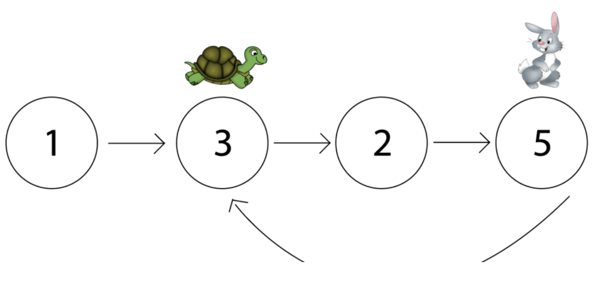
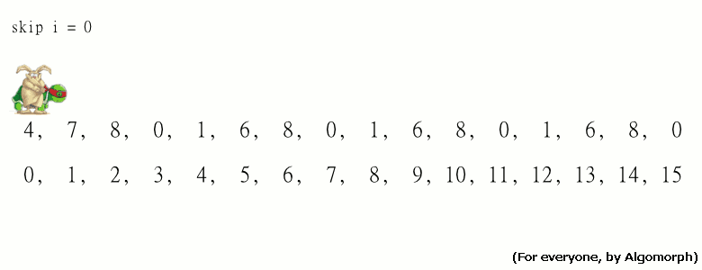
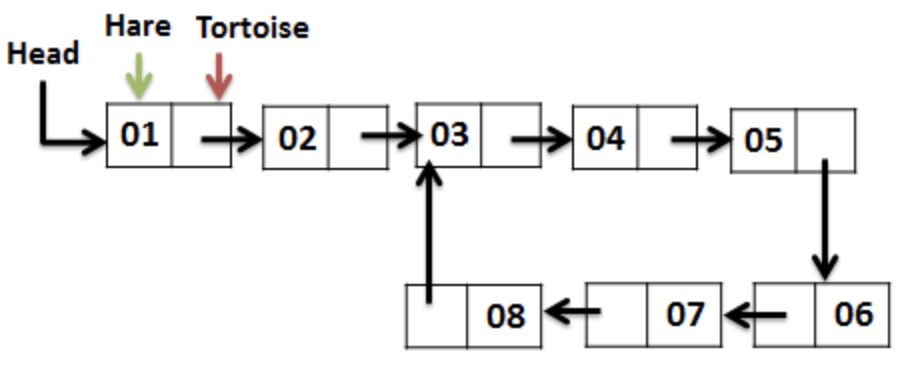
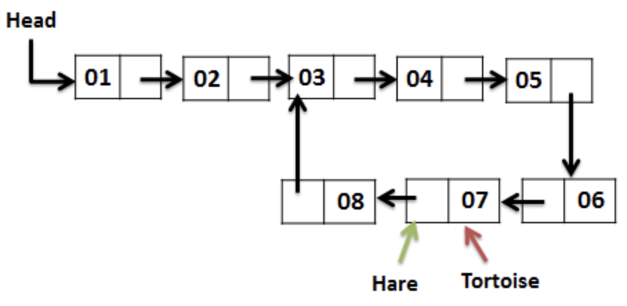

This algorithm was actually used to solve the last problem that we tackled - finding <ins class="sub-ins-2">duplicate</ins> in an array. I didn't really explain the algorithm back when I solved the problem, but I would like to tackle that problem here.

Well, we certainly know that a duplicate in an array can be identified using several different ways (<ins class="sub-ins-2">sorting</ins> the array and performing a <ins class="sub-ins-2">linear scan</ins> or using a <ins class="sub-ins-2">HashMap</ins>), but it turns out the Tortoise and Hare Algorithm can do it in constant <ins class="sub-ins-2">O(1)</ins> space. And, that is what makes Tortoise and Hare Algorithm so efficient.

If you don't really remember what the problem was, let me remind that for you.

## Problem Statement:

Given an array nums containing (n + 1) integers where each integer is between 1 and n (inclusive), prove that at least one duplicate number must exist. Assume that there is only one duplicate number, find the duplicate one.

**Example 1:**

```
Input: [1,3,4,2,2]
Output: 2
```

## Approach:

The approach to solve this problem would be using two pointers. Let us take 2 pointers namely a <ins class="sub-ins-2">slow pointer</ins> and a <ins class="sub-ins-2">fast pointer</ins> to traverse a Singly Linked List at different speeds. The slow pointer (Also called <ins class="sub-ins-2">Tortoise</ins>) moves one step forward while the fast pointer (Also called <ins class="sub-ins-2">Hare</ins>) moves 2 steps forward.

The following are the steps of execution of the alogirthm:

1. Start Tortoise and Hare at the first node of the List.
2. Make Hare move two steps forward.
3. While Tortoise moves one step forward.
4. If Hare reaches end of the List, return as there is no loop in the list.
6. Check if Hare and Tortoise points to the same Node, if yes, return, we found loop in the List.
7. Else start with STEP-2.



### Pseudocode

```
tortoise := firstNode
hare := firstNode

forever:

  if hare == end
    return 'No Loop Found'

  hare := hare.next

  if hare == end
    return 'No Loop Found'

  hare = hare.next
  tortoise = tortoise.next

  if hare == tortoise
    return 'Loop Found'
```

### Example



Both Tortoise and Hare starts at the very first node. While Tortoise moves 1 step forward (since they are slower than hare), Hare moves 2 steps forward at a time.

The movements of the Tortoise and Hare until they find the cycle is tracked below:

| HARE | TORTOISE |
| :--: | :------: |
|  1   |    1     |
|  3   |    2     |
|  5   |    3     |
|  7   |    4     |
|  3   |    5     |
|  5   |    6     |
|  7   |    7     |



As we can see both the Hare and the Tortoise meet at Node 7, and hence we can identify that there is a cycle in the list. Returning the Hare or the Tortoise (any one) will return us the number that has been repeated.

## Complexity Analysis:

- <ins class="sub-ins-2">Time - O(n)</ins> -> Since in the worst case we have to travel the entire array to find a cycle.
- <ins class="sub-ins-2">Space - O(1)</ins> -> Constant space because we are doing it inplace.

### Quick Question...

You might have a question on how as to when the tortoise and hare meets for the first time, the start of the cycle can be determined by moving tortoise pointer back to start and then moving both tortoise and hare one step at a time. How is that even possible?

Well, there's actually a well written proof that states that this phenomenon is very likely and it persists without a doubt. If you are interested about the same kindly click [here](https://cs.stackexchange.com/questions/10360/floyds-cycle-detection-algorithm-determining-the-starting-point-of-cycle).
