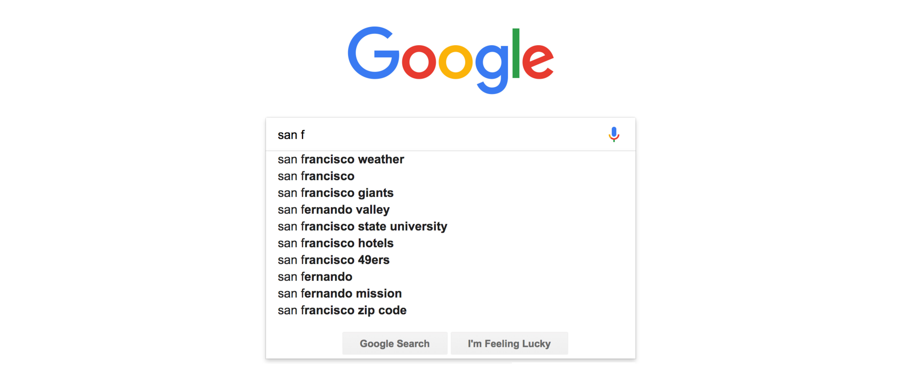

A lot of us would feel data structures like <ins class="sub-ins-2">Trie</ins> are obscure and trivial. That is what atleast I felt when I started learning data structures. Well, it is evident that you and me feel this way because not many times (even during solving coding problems) we see them often. But I still wanted to know about it, and that if I happen to ever need it, I wouldn't be surprised that a data structure like Trie exists.

I will try to cover only the basics and open the door for you to explore a lot more things with Trie. Additionaly, reference links will be attached at the end of this article for you to refer to know, what's next.

**_According to Wikipedia:_**

> A trie, also called prefix tree, is kind of an ordered tree, used to store a dynamic set or associative array where the keys are usually strings.

There are a few trie definitions that we need to be rigour about:

- Unlike a binary search tree or a <ins class="sub-ins-2">BST</ins>, no node in the tree stores the <ins class="sub-ins-2">key</ins> associated with that node.
- The <ins class="sub-ins-2">position</ins> of the node in the tree defines the key with which it is associated.
- All the <ins class="sub-ins-2">descendants</ins> of a node have a common <ins class="sub-ins-2">prefix</ins> of the string associated with that node, and the <ins class="sub-ins-2">root</ins> is associated with the empty string.

**_In layman terms:_**

> A tree is a special data structure that is used to store strings compactly.

---

Below is a Trie/Prefix Tree that stores the word _ARTIST_, _BUCK_, _BUNNY_ and _DOG_.

**_Notice_** even if the word <ins class="sub-ins-2">BUCK</ins> and <ins class="sub-ins-2">BUNNY</ins> has the same prefixes <ins class="sub-ins-2">'B'</ins> and <ins class="sub-ins-2">'U'</ins>, they are still stored as one.

### Advantages of Trie:

- <ins class="sub-ins-2">Space-Efficient</ins> . If you store words with similar patterns/prefixes, (the one that we saw with BUCK and BUNNY) in the previous diagram, tries may actually help reduce the overall storage cost by handling shared prefixes.
- <ins class="sub-ins-2">Efficient Queries</ins> . Tries can help quickly query words with shared prefixes. For eg:
- How many words start with "BU"?, or what's most likely to come up after the word "DO"? We call it 'autocommplete'.

That is where the most use case scenario of <ins class="sub-ins-2">Trie</ins> comes in. Trie can be used as a data structure to suggest us words or letters based on the <ins class="sub-ins-2">prefixes</ins> , the feature that we call <ins class="sub-ins-2">'autocomplete'</ins> . Yes! You certainly guessed it right, <ins class="sub-ins-2">search</ins> <ins class="sub-ins-2">engines</ins> like Google uses Trie for the autocomplete suggestions.

<!--  -->

### Disadvantages of Trie:

- Some tries can require more <ins class="sub-ins-2">space</ins> than a <ins class="sub-ins-2">hash</ins> <ins class="sub-ins-2">table</ins>, as memory may be allocated for each character in the search string, rather than a single chunk of memory for the whole entry, as in most hash tables.

- ASCII characters in a string are one byte each. Each link between trie nodes is a <ins class="sub-ins-2">pointer</ins> to an address—eight bytes on a 64-bit system. So, the <ins class="sub-ins-2">overhead</ins> of linking nodes together often outweighs the savings from storing fewer characters.

- <ins class="sub-ins-2">Not Standard</ins>. Most languages don't come with the in-built <ins class="sub-ins-2">implementation</ins> of trie. You might need to implement one yourself from scratch.

---

### Time and Space Complexities

<ins class="sub-ins">Time - O(n)</ins> | <ins class="sub-ins">Lookup - O(n)</ins> | <ins class="sub-ins">Space - O(n \* m)</ins>

- As we can have no more than NM nodes in the trie, and that you need to initialize every node only once, so you will initialize all the nodes at most NM times (once for every node). Hence, the space complexity of the trie is O(NM).

---

Now, that we have a bare minimum knowledge of what a Trie data structure I would suggest you to go ahead and checkout the reference links to know more about Trie, and probably try to implement one from scratch.

➡ [Wikipedia](https://en.wikipedia.org/wiki/Trie#:~:text=In%20computer%20science%2C%20a%20trie,the%20keys%20are%20usually%20strings.)  
➡ [Interview Cake](https://www.interviewcake.com/concept/java/trie) 
➡ [Geeks for Geeks](https://www.geeksforgeeks.org/trie-insert-and-search/)

Here's your pun for the day: 😁

> **Trie** **Trie** until you succeed.
